# ADB-02-ngs-linux (theory and notes)

**Introduction to the Linux command line, NGS data formats, read mapping and alignments**

*Fernando Pozo*

*Wednesday, 2nd September, 2020*

---

## Table of Contents

* [Next-generation sequencing (NGS)](#next-generation-sequencing--ngs-)
  + [Why next-generation sequencing?](#why-next-generation-sequencing-)
    - [Sanger vs. NGS](#sanger-vs-ngs)
  + [NGS platforms](#ngs-platforms)
  + [NGS protocol design](#ngs-protocol-design)
    - [Read Length for Different Applications](#read-length-for-different-applications)
  + [Sequencing technology overview](#sequencing-technology-overview)
    - [Illumina](#illumina)
* [NGS File Formats](#ngs-file-formats)
  + [NGS Bioinformatics Pipeline](#ngs-bioinformatics-pipeline)
  + [NGS File Formats](#ngs-file-formats-1)
    - [Sequence data output format](#sequence-data-output-format)
    - [Understanding FASTQ format](#understanding-fastq-format)
* [Read Mapping and Alignments](#read-mapping-and-alignments)
  + [NGS Bioinformatics Pipeline](#ngs-bioinformatics-pipeline-1)
  + [Read Mapping and Alignments](#read-mapping-and-alignments-1)
    - [How to map billions of short reads onto genomes](#how-to-map-billions-of-short-reads-onto-genomes)
  + [Reference Based Assembly](#reference-based-assembly)
    - [The Burrows–Wheeler transform](#the-burrows-wheeler-transform)
  + [NGS File Formats](#ngs-file-formats-2)
    - [SAM (Sequence Alignment/Map) format](#sam--sequence-alignment-map--format)
    - [Other interesting NGS data format files](#other-interesting-ngs-data-format-files)
* [Linux Command-Line Interface](#linux-command-line-interface)
  + [Why we need an Operating System (OS)?](#why-we-need-an-operating-system--os--)
  + [Linux Distributions](#linux-distributions)
  + [Why use Linux for sequencing data?](#why-use-linux-for-sequencing-data-)
  + [Why use Linux for sequencing data?](#why-use-linux-for-sequencing-data--1)
  + [Linux Directory Structure](#linux-directory-structure)
  + [Linux Commands](#linux-commands)
    - [Basic Commands](#basic-commands)
    - [Intermediate Commands](#intermediate-commands)

---

**Note**

All the links are [clickable](https://gitlab.com/fpozoc/advanced_bioinformatics/-/tree/master/ADB-02-ngs-linux/theory). They contain references, databases and interesting sources to know more about our pipeline.

---

## Next-generation sequencing (NGS)

### Why next-generation sequencing?

#### Sanger vs. NGS

- For almost 30 years, sequencing of DNA has largely been dependent on the 1 st generation Sanger dideoxy sequencing method.

- Sanger sequencing requires each sequence read to be amplified and read individually. Despite considerable improvements in automation and throughput, Sanger sequencing remains relatively expensive and labor intensive.
In both technologies:
- DNA Polymerase adds fluorescent nucleotides one by one onto a growing DNA template strand.
- Each incorporated nucleotide is identified by its fluorescent tag.

*Diseño experimental: ¿Qué queremos hacer y cómo lo vamos a realizar?*
*Secuenciación de Sanger = Copias amplificadas de forma individual = +Tiempo = +Dinero*
*Tecnologías parecidas per se. Adición de nucleótidos de fluorescencia a cadena de ADN identificados por un tag fluorescente*rescente. 

---

- The critical difference between Sanger sequencing and NGS is sequencing volume.
- While the Sanger method only sequences a single DNA fragment at a time, NGS is massively parallel, sequencing millions of fragments simultaneously per run.
- NGS high-throughput process translates into sequencing hundreds to thousands of genes at one time.

*Diferencia crítica: Volumen de secuenciación.*
*Millones de secuenciaciones paralelas*
*Secuencia miles de genes (también intrones) al mismo tiempo.*

---
- “With Sanger sequencing, we saw a limited DNA snapshot... NGS and its massively parallel sequencing enable us to look at tens to hundreds of thousands of reads per sample.”

*Con la secuenciación de Sanger tenemos una imagen pequeña (y muy certera) del genoma. Con tecnologías NGS la cuestión es diferente. Millones de lecturas por muestra.*

---

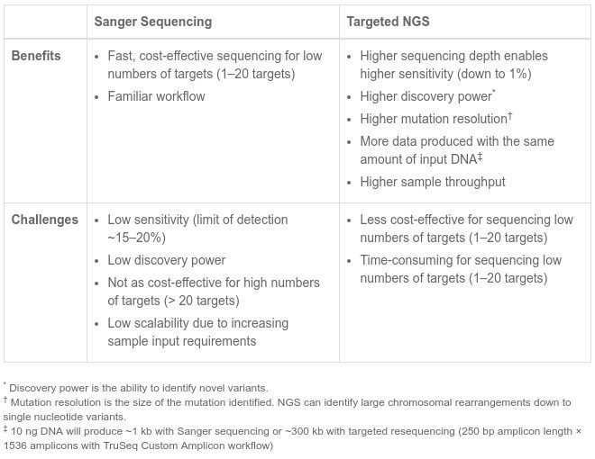

Figure: Challenges and Benefits of Sanger Sequencing and NGS

*No todos los laboratorios tienen un secuenciador NGS (puede no ser necesario dependiendo del experimento)*
*SANGER es sencillo, familiar, rápido (si queremos secuenciar de 1 a 20 genes / targets)*
*NGS podemos secuenciar a mayor profundidad, mayor sensibilidad, poder de descubrimiento más alto, mayor rendimiento por muestra, y más datos (OJO CON ESTO) producidos con la misma cantidad de DNA.*
*NGS puede ser útil para pocos targets. Lógicamente, en escala coste-efectividad es peor, además, más lento.*

---

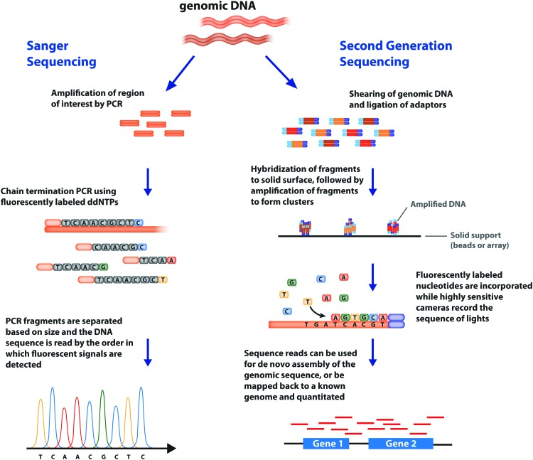

Figure: NGS platforms can sequence millions of DNA fragments in parallel in one reaction

*Secuenciación de Sanger: se pueden conseguir aproximadamente 700 bases por reacción.*

---
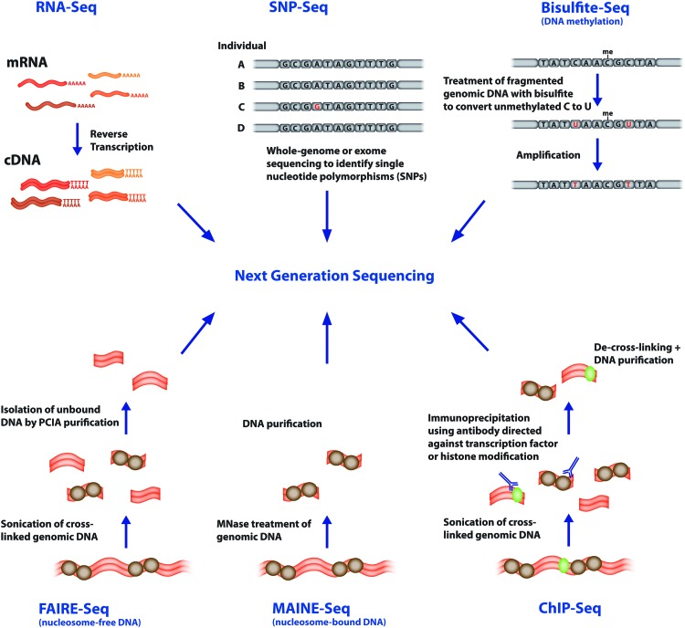

Figure: The types of experiments that can be performed using NGS are many fold

*Figures reference: Bunnik EM, Le Roch KG. An Introduction to Functional Genomics and Systems Biology. Adv Wound Care (New Rochelle). 2013;2(9):490-498. doi:10.1089/wound.2012.0379*

*Secuenciación del genoma completo.*
*Secuenciación del exoma para detectar regiones codificantes del genoma.*
*Identificar polimorfismos de un solo nucleótido para identificar polimorfismos/mutaciones a nivel de ADN (SNP-Seq).*
*Ubicar las citosinas metiladas en todo el genoma (Bisulfite-Seq).*
*Investigar varios aspectos de la estructura de la cromatina y de la regulación de la expresión génica mediante la determinación del posicionamiento de nucleosomas, que son las unidades fundamentales de la cromatina (MAINE-Seq y FAIRE-Seq (actividad reguladora)).*
*Modificación de histonas o la unión del factor de transcripción (ChIP-Seq).*
*Determinación de los niveles de ARNm para estudiar la expresión génica y su regulación (RNA-Seq).*

---

### NGS platforms

- [Roche 454 platform](https://pubmed.ncbi.nlm.nih.gov/16056220/) (Roche Life Sciences).
*Margulies M, Egholm M, Altman WE, et al. Genome sequencing in microfabricated high-density picolitre reactors [published correction appears in Nature. 2006 May 4;441(7089):120. Ho, Chun He [corrected to Ho, Chun Heen]]. Nature. 2005;437(7057):376-380. doi:10.1038/nature03959*
- [Applied Biosystems SOLiD platform](https://pubmed.ncbi.nlm.nih.gov/16081699/) (Applied Biosystems).
*Shendure J, Porreca GJ, Reppas NB, et al. Accurate multiplex polony sequencing of an evolved bacterial genome. Science. 2005;309(5741):1728-1732. doi:10.1126/science.1117389*
- [Illumina Genome Analyzer](https://pubmed.ncbi.nlm.nih.gov/18987734/) (formerly known as Solexa) and HiSeq platforms (Illumina).
*Bentley DR, Balasubramanian S, Swerdlow HP, et al. Accurate whole human genome sequencing using reversible terminator chemistry. Nature. 2008;456(7218):53-59. doi:10.1038/nature07517*
- [Ion Torrent](https://pubmed.ncbi.nlm.nih.gov/21776081/) (Termofisher).
*Rothberg JM, Hinz W, Rearick TM, et al. An integrated semiconductor device enabling non-optical genome sequencing. Nature. 2011;475(7356):348-352. Published 2011 Jul 20. doi:10.1038/nature10242*
- 3rd generation sequencing (Single molecule level & Longer Reads):
    - [PacBio Sequencing](https://www.ncbi.nlm.nih.gov/pmc/articles/PMC4678779/) (PacBio).
Rhoads A, Au KF. PacBio Sequencing and Its Applications. Genomics Proteomics Bioinformatics. 2015;13(5):278-289. doi:10.1016/j.gpb.2015.08.002
    - [MinION](https://genomebiology.biomedcentral.com/articles/10.1186/s13059-016-1103-0#citeas) (Oxford Nanopore).
    *Jain M, Olsen HE, Paten B, Akeson M. The Oxford Nanopore MinION: delivery of nanopore sequencing to the genomics community [published correction appears in Genome Biol. 2016 Dec 13;17 (1):256]. Genome Biol. 2016;17(1):239. Published 2016 Nov 25. doi:10.1186/s13059-016-1103-0*

---

### NGS protocol design

**Quality Scores**
Measure the probability that a base is called incorrectly. It uses the phred-like algorithm (similar to that originally developed for Sanger).

*Puntuación de calidad de cada base o probabilidad de cometer un error. Presente en los archivos que generará la secuenciación (a no ser que especifiquemos lo contrario para reducir el tamaño del archivo).*

**Paired-End vs. Single-End**
Paired-end sequencing allows users to sequence both ends of a fragment and generate high-quality, alignable sequence data. It facilitates detection of genomic rearrangements and repetitive sequence elements, as well as gene fusions and novel transcripts.

Producing twice the number of reads for the same time and effort in library preparation, sequences aligned as read pairs enable more accurate read alignment and the ability to detect insertion-deletion (indel) variants, which is not possible with single-read data. All Illumina next-generation sequencing (NGS) systems are capable of paired-end sequencing.

*¿Lecturas pareadas o simples?*
*La elección dependerá principalmente de 2 factores: A) Objectivo del estudio. B) Presupuesto y tiempo disponible*
*Lecturas pareadas serán la opción si queremos detectar reorganizaciones genómicas, secuencias repetitivas, fusiones de genes (genes que con la evolución se han convertido en uno), delecciones, inserciones, transcritos nuevos (no anotados)...*
*A tener en cuenta: Las lecturas pareadas ocuparán el doble de espacio (doble capacidad de almacenamiento) y la secuenciación tardará, por lo general, también el doble de tiempo*.

---

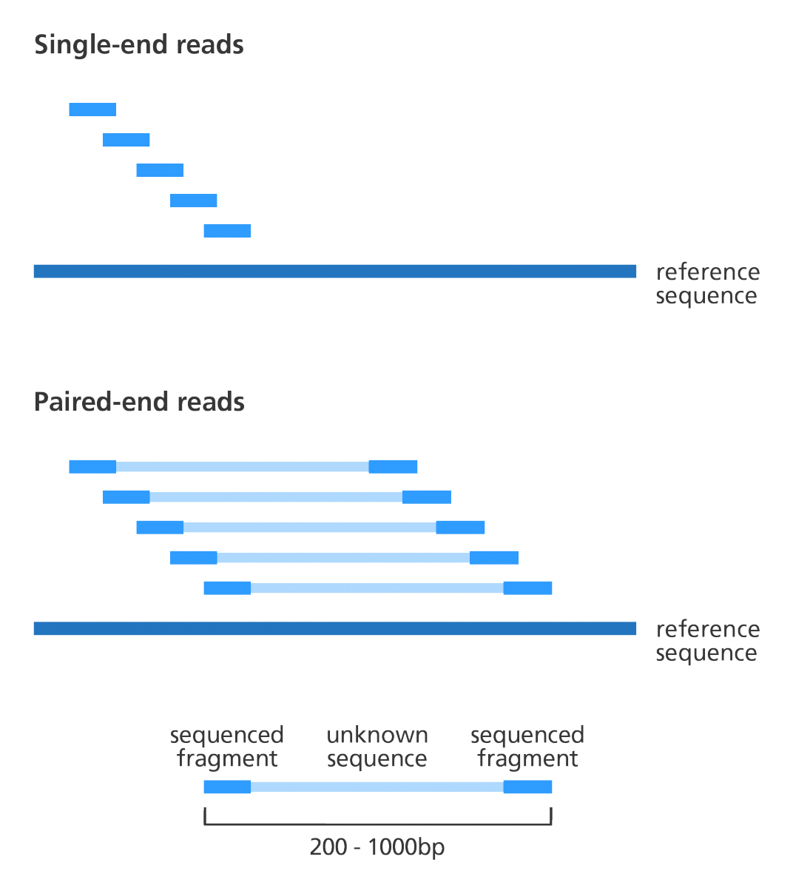

---

**Multiplex Sequencing**
Multiplex sequencing allows large numbers of libraries to be pooled and sequenced simultaneously during a single run on a high-throughput instrument. Individual barcode sequences are added to each DNA fragment during NGS library preparation so that each read can be identified and sorted before the final data analysis.

*Útil para varias aplicaciones, sobre todo si se quiere muestrear de forma masiva un genoma pequeño (por ejemplo). Muestras dirigidas. A cada muestra se le asigna un identificador (barcode).*

**Read Length**
Number of base pairs (bp) sequenced from a DNA fragment. The right sequencing read length depends on your sample type, application, and coverage requirements.

Examples: 

- Long reads: de novo assembly and resolving repetitive areas of the genome with greater confidence. 
- Other applications: shorter reads are sufficient and more cost-effective than longer ones

*Diferente para cada tecnología. Las lecturas largas vienen muy bien para ensamblaje de novo porque lógicamente (vamos a ser capaces de cometer menos errores ya que tendremos que alinear lecturas menos veces), y también para las secuencias repetitivas. Sin embargo las lecturas más cortas a veces son suficientes para el objetivo que queremos, y con el alineamiento vale. En relación coste-efectividad estas últimas son más válidas.*

#### Read Length for Different Applications

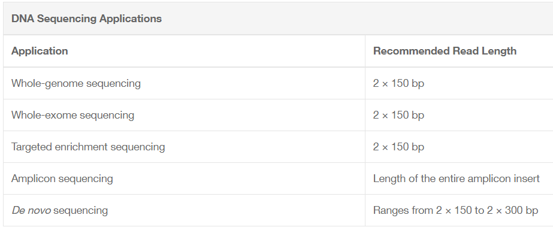

---

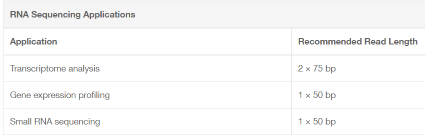

*Illumina recomienda una determinada longitud de lectura tanto para secuenciación del ADN como del ARN y es dependiente de la aplicación deseada.*

---
**Coverage**
Average number of reads that align to known reference bases. Variant discovery can be made with a certain degree of confidence at particular base positions.

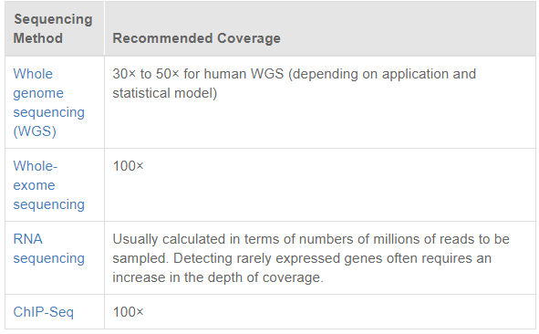

Figure: Sequencing Coverage Requirements

*La cobertura es el número medio de lecturas que alinean contra una referencia. De nuevo, dependiendo del uso que le queramos dar podemos elegir secuenciar a una cobertura deseada u otra.*

---

**Deep Sequencing**
Sequencing a genomic region multiple times, sometimes hundreds or even thousands of times.

The case of Cancer Research: Required sequencing depth increases for low purity tumors, highly polyclonal tumors, and applications that require high sensitivity (identifying low frequency clones). Cancer sequencing depth typically ranges from 80 to up to thousands-fold coverage.

Factors Impacting Cancer Sequencing Depth:

- Purity of the tumor.
- Heterogeneity of the tumor.
- Sensivity required.

*Es interesante comentar el caso de investigación en Cáncer donde nos vemos con la necesidad de secuenciar el genoma de células de un tejido particular para ver la pureza del tumor, su evolución o su heterogeneidad. Los tumores van mutando muchísimo y podemos ir descifrando la historia evolutiva. Por último, es interesante comentar el caso de la secuenciación de single cell.*

---

### Sequencing technology overview

#### Illumina

- Length is in range of 50 to 300 nt.
- It uses a glass flowcell, about the size of a microscope slide, with 8 separate lanes.

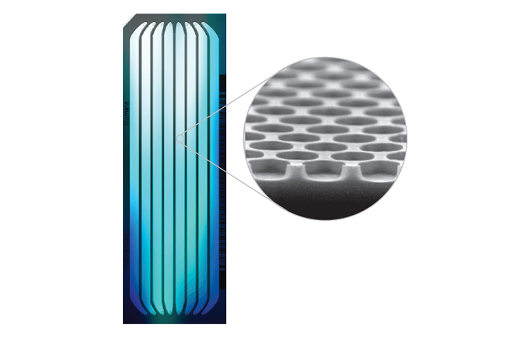

---

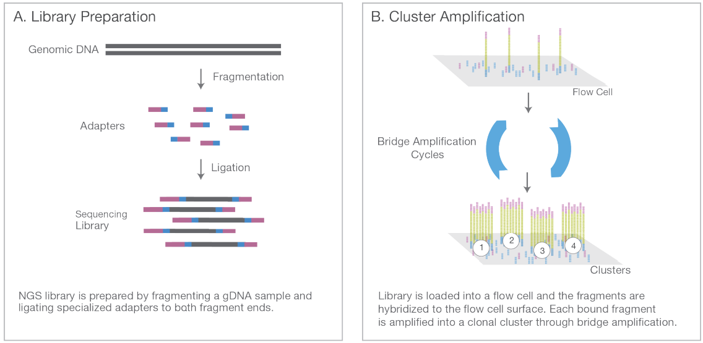

---

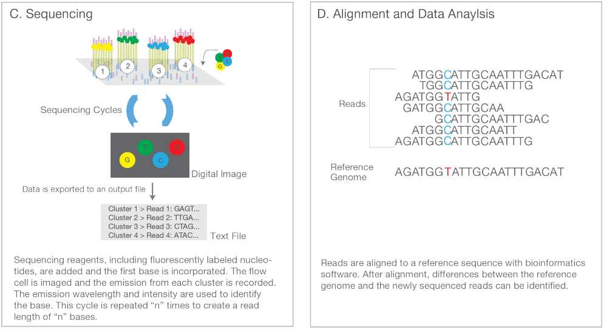

*Figures references: [An introduction to Next-Generation Sequencing Technology](https://www.illumina.com/content/dam/illumina-marketing/documents/products/illumina_sequencing_introduction.pdf).*

---

## NGS File Formats

### NGS Bioinformatics Pipeline

- Quality Control of FASTQ sentence files.
- Read mapping against some Reference Genome.
- Analysis of the mapped reads:
  * Variant Calling (Exome, genome...).
  * Differential Expression (RNA-seq).
  * Peak calling (ChIP-seq)
- Visualization.
- Biomedical interpretation.

*Flujo de trabajo clásico de un análisis bioinformático*
*Archivos en formato FASTQ que nos indicarán la secuencia de cada read y su calidad.*
*Mapeo y alineamiento esas lecturas contra una referencia por lo que tendremos formatos que nos reportan estadísticas del alineamiento. En las clases posteriores veréis archivos para variant calling, expresión diferencial, chip seq, visualización e interpretación.*

---

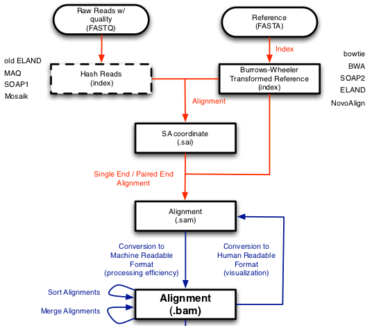

---

### NGS File Formats

- Many different file formats that reflect the various steps of the analysis.
- We are going to introduce the most common formats today.
- Some of them are going to be used in our Hands-On.
- Remaining lectures will fill in details and lead into another types of analysis with another formats.

---

#### Sequence data output format

- DNA sequence data are typically provided with quality scores, either as paired files or combined in a [FASTQ](https://en.wikipedia.org/wiki/FASTQ_format) file.

- In separate files, DNA sequences are in [FASTA](https://en.wikipedia.org/wiki/FASTA_format) format 

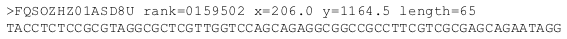

- and quality scores are numbers from 0 to 40 (SCARF format)

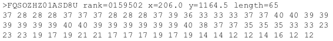

- In FASTQ format , DNA sequences look similar, but quality scores are encoded assingle text characters rather than as numbers

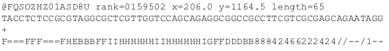

*FASTA (secuencia) + SCARF (calidad secuenciación): dos archivos.*
*FASTQ es el formato más común: refleja las calidades por caracteres en lugar de por números (gestión más eficiente).*

---

#### Understanding FASTQ format

- Most recent Illumina Sequences are reported in FASTQ format.
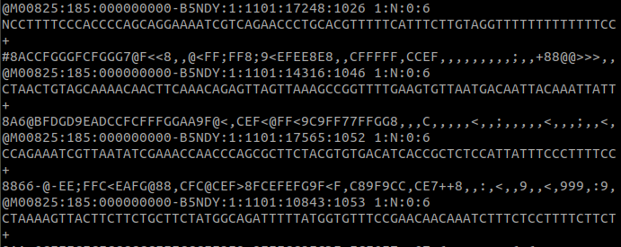

- 1. Read identifier:
  * Unique instrument name
  * Run id 
  * Flowcell id
  * Flowcell lane 
  * Number within the flowcell lane 
  * x-coordinate of the cluster within the tile 
  * y-coordinate of the cluster within the tile 
  * the member of a pair, 1 or 2 (paired-end or mate-pair reads only) 
  * Y if the read is filtered, N otherwise
  * 0 when none of the control bits are on, otherwise it is an even number 
  * sample number

*FASTQ recoge todas las lecturas de una secuenciación*
*Es un formato que se ha ido actualizando, y que además cada secuenciador reporta FASTQ con ligeras diferencias.
*En la línea 1 (seguida de @)*
*Un nombre único de nuestro secuenciador*
*Un identificador del proceso de secuenciación*
*Un identificador de la célula de flujo*
*En qué carril de la célula de flujo está esa lectura*
*El número dentro de la célula de flujo*
*Coordenada x de la celda*
*Coordenada y de la celda*
*Si es lectura pareada, ¿qué miembro del par es?*
*Y si se filtra el read (no pasa el proceso de filtrado por calidad) y N si no se filtra*
*0 si no es una lectura de control (propia de algunos secuenciadores)...si si lo es, será un número par*
*Identificador de muestra / index sequence (no en esta versión de Illumina)*

---

- Most recent Illumina Sequences are reported in FASTQ format
  1. Read identifier
  2. Raw sequence reported by the machine
  3. ’+’ (can optionally include a sequence description).
  4. The FASTQ format encodes [PHRED](https://en.wikipedia.org/wiki/Phred_quality_score) scores as ASCII characters alongside the read sequences.

- Quality scores are numbers which represent the probability that the given base call is an error.
- These probabilities are always less than 1, so the value is given as -10x(log10) of the probability.
- An error probability of 0.001 is represented as a quality of score of 30.
- The numbers are converted into text characters so they occupy less space. A single character is as meaningful as 2 numbers plus a space between adjacent values.

*Línea 2: secuencia*
*Línea 3: opcionalmente tendremos una descripción. En la lectura que acabamos de seleccionar no tenemos nada.* 
*Línea 4: puntuación de calidad para cada posición de la lectura, codificado por el algoritmo de PHRED. Este número representa la probabilidad de que exista un error en esa base.*
*Fórmula para calcular el error. 10 elevado a menos 3 representa una calidad de 30. O lo que es lo mismo una probabilidad de 0.001 de que sea un error.*
*Los números son convertidos en caracteres de texto para ocupar menos espacio (una sola cifra).*

---

- Unfortunately, at least 4 different ways of converting numbers to characters have been widely used, and header line formats have also changed, so one aspect of data analysis is knowing what you have.

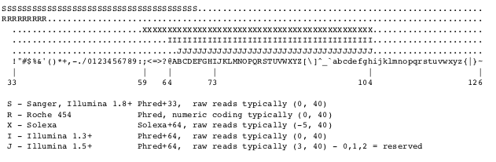

Figure: Reference table

*Tabla de conversiones entre diferentes formatos. Al menos 4 diferentes.*

---

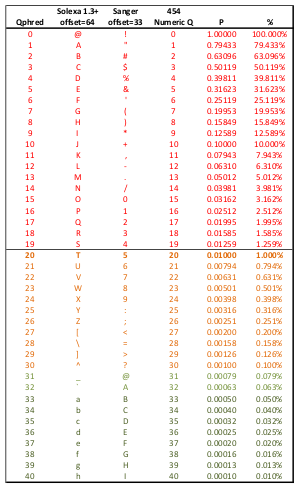

---

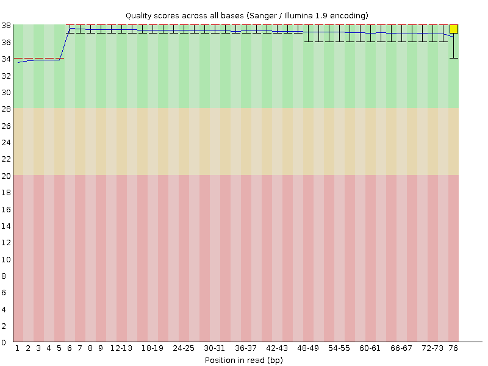

Figure: Practical per base quality view generated with FastQC package

*Output que reporta el software de control de calidad FastQC*

---

## Read Mapping and Alignments

### NGS Bioinformatics Pipeline

### Read Mapping and Alignments

Once high-quality data are obtained from preprocessing, the next step is the read mapping or alignment.

There are two main options depending on the availability of a genome sequence:

- When studying an organism with a reference genome, it is possible to infer which transcripts are expressed by mapping the reads to the reference genome (genome mapping) or transcriptome (transcriptome mapping). Mapping reads to the genome requires no knowledge of the set of transcribed regions or the way in which exons are spliced together. This approach allows the discovery of new, unannotated transcripts.

- When working on an organism without a reference genome, reads need to be assembled first into longer contigs (de novo assembly). These contigs can then be considered as the expressed transcriptome to which reads are re-mapped for quantification. De novo assembly algorithms are constructed with de Bruijn graphs.

*Mapeo y alineamiento*
*El mapeo se refiere al proceso de alinear lecturas cortas a una secuencia de referencia, ya sea que la referencia sea un genoma completo, transcriptoma o ensamblaje de novo.*
*Existen numerosos programas que se han desarrollado para mapear las lecturas a una secuencia de referencia que varía en sus algoritmos y, por lo tanto, en su eficiencia (ver 1). El programa que utilizamos en esta tubería se llama BWA (ver 2). Utiliza un método de transformación de Burrows-Wheeler que resulta en un procesamiento mucho más rápido que la primera ola de programas que usaron un algoritmo basado en hash como MAQ (ver 3). El objetivo del mapeo es crear un archivo de alineación también conocido como archivo de SAM para cada una de sus muestras. Este archivo SAM contendrá una línea para cada una de las lecturas en su muestra que denota la secuencia de referencia (genes, contig o regiones de genes) a la que se asigna, la posición en la secuencia de referencia y un puntaje de calidad con escala de Phred del mapeo, entre otros detalles (ver 2). Utilizará los archivos SAM para sus muestras para extraer información de expresión génica (el número de lecturas que se asignan a cada secuencia de referencia) e identificar polimorfismos en sus datos.*

*1. Flicek P, Birney E. Sense from sequence reads: methods for alignment and assembly. Nat Methods. 2009;6(11 Suppl):S6-S12. doi:10.1038/nmeth.1376*
*2. Heng Li, Richard Durbin, Fast and accurate short read alignment with Burrows–Wheeler transform, Bioinformatics, Volume 25, Issue 14, 15 July 2009, Pages 1754–1760, https://doi.org/10.1093/bioinformatics/btp324*
*3. Li H, Ruan J, Durbin R. Mapping short DNA sequencing reads and calling variants using mapping quality scores. Genome Res. 2008;18(11):1851-1858. doi:10.1101/gr.078212.108*

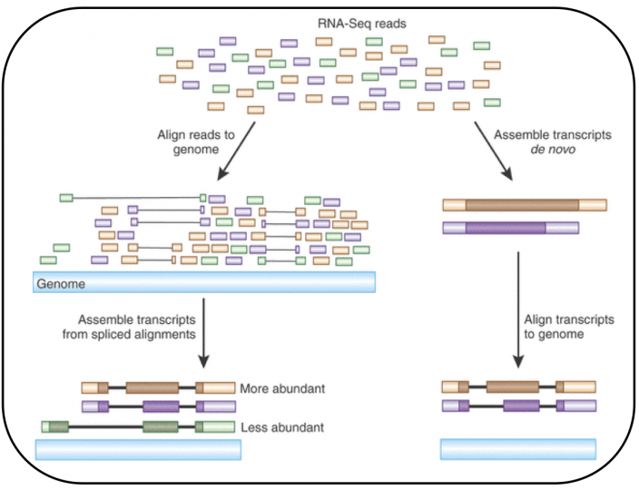

---

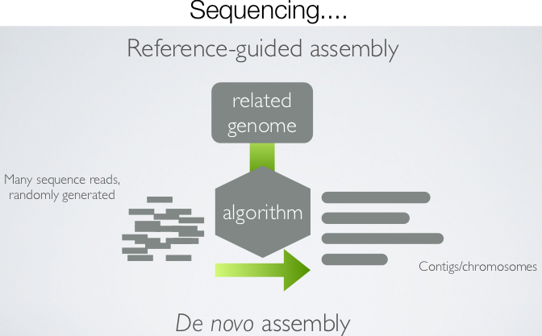

---

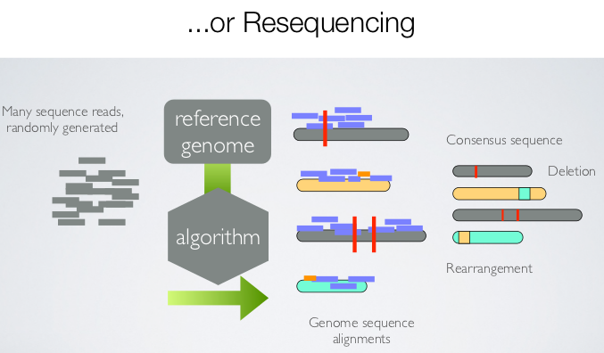

---

#### How to map billions of short reads onto genomes

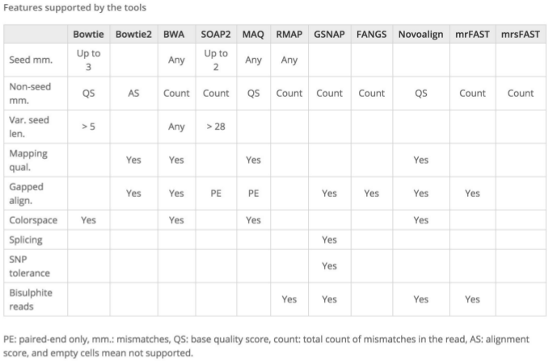

*Figure reference: Hatem A, Bozdağ D, Toland AE, Çatalyürek ÜV. Benchmarking short sequence mapping tools. BMC Bioinformatics. 2013;14:184. Published 2013 Jun 7. doi:10.1186/1471-2105-14-184*

*Vemos que tenemos muchas posibilidades dependiendo de lo que queramos analizar. Y para cada una de ellas tenemos programas que se han creado con diferentes fines*

### Reference Based Assembly

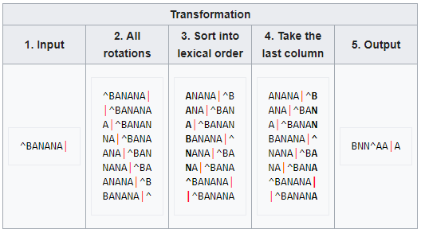

Figure: The Burrows–Wheeler transform (BWT, also called block-sorting compression) rearranges a character string into runs of similar characters. This is useful for compression, since it tends to be easy to compress a string that has runs of repeated characters by techniques such as move-to-front transform and run-length encoding. More importantly, the transformation is reversible, without needing to store any additional data except the position of the first original character. The BWT is thus a free method of improving the efficiency of text compression algorithms, costing only some extra computation.

*Tenemos que indexar la referencia  ¿Cómo lo hacemos? Explicar BWT. ¿Por qué este algoritmo comprime la información? No es lo mismo alinear dos secuencias, que alinear millones de reads. Esto tiene que ser un proceso rápido y eficiente contra una referencia. Antiguos programas basados en hashing eran muy lentos. Ahora estan basados en BWT.*

*Objetivo: Matchear millones de cadenas cortas (por ejemplo, de entre 50 y 100 caracteres) en un texto (genoma de referencia) muchísimo más largo (por ejemplo 3 billones de caracteres). La referencia es fija dependiendo de la especie. Necesitaremos un algoritmo que nos permita buscar en un texto lo más rápido posible. Ello va a requerir de preprocesar esta referencia (en un índice mediante FM) y después mapear las lecturas (dependiendo de lo largas que sean tardaremos más o menos).*

---

#### The Burrows–Wheeler transform

- When a string of characters is transformed by the BWT, none of its characters change the value (it is a lossless compression algorithm).
- The transformation changes the order of the characters. If the original string had several substrings that occurred frequently, then the transformed string has several sites where a single character is repeated consecutively. 
- This is very useful in compression: it is easier to compress a string that has several characters repeated together with techniques such as RLE encoding (run-length encoding).

*Características principales de BWT*

---

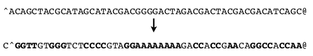

Figure: BWT example with DNA. From 54 to 45 characters with this transformation

*Ejemplo real de secuencia de ADN transformado por BWT*

---

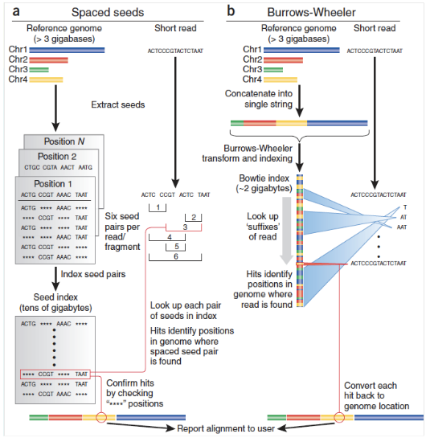

*Caso real: Bowtie (basado en BWT) indexa la referencia. Va localizando los sufijos de los reads y va descartando, y de esa forma va realizando el alineamiento. Hashing vs. BWT. El seed hashing te da todas las posibilidades de encontrar un read y computacionalmente es mucho más pesado. A mayor tamaño del seed de búsqueda, mayor necesidad de almacenamiento en disco. A menor longitud, más tiempo de computación. Son dos grandes problemas por lo que los métodos basados en BWT han supusieron un gran cambio.*

---

### NGS File Formats

#### SAM (Sequence Alignment/Map) format

- [SAM](https://en.wikipedia.org/wiki/SAM_(file_format)) (Sequence Alignment/Map) is a generic format for storing large nucleotide sequence alignments.
- SAM is is the human readable, scriptable format. A [BAM](https://support.illumina.com/help/BS_App_MDProcessor_Online_1000000007932/Content/Source/Informatics/BAM-Format.htm) file is essentially a binary (gzip-compressed) version of a SAM file. 
- SAM/BAM files are usually sorted and indexed to streamline data processing. Both contains exactly the same information, and are interconvertible

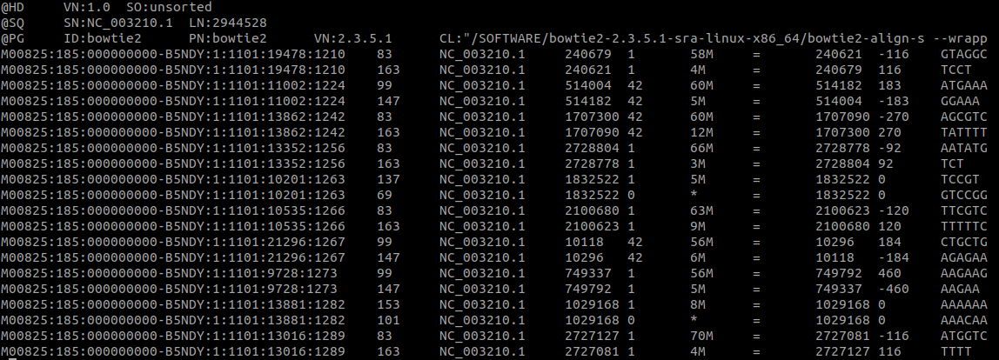

Figure: SAM file format sample file

*Formato SAM (Sequence Alignment Map). Es posible ser interpretado por humanos. BAM es el formato comprimido y binario*

---

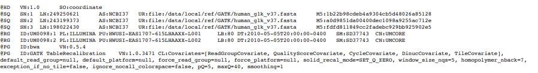

Figure: SAM file format Header

---

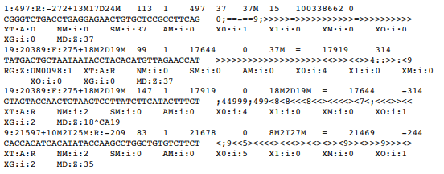

Figure: SAM file format Alignment

*En un SAM tenemos un header (información de la secuenciación) y unas estadísticas de alineamiento*

---

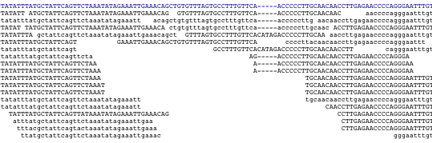

Figure: Read Mapping example

---

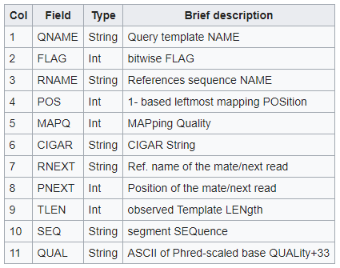

Figure: Alignment sections have 11 mandatory fields

*1. QNAME: Identificador de lectura*
*2. FLAG: Identificador del alineamiento*
*3. RNAME: Nombre de la referencia*
*4. POS: Primer carácter del mapeo*
*5. MAPQ: Calidad del mapeo*
*6. CIGAR: Secuencia CIGAR (resumen del mapeo)*
*7. RNEXT: Referencia de la siguiente lectura*
*8. PNEXT: Posición de la siguiente lectura*
*9. TLEN: Tamaño del fragmento*
*10. SEQ: Secuencia*
*11. QUAL: Calidad del alineamiento*

---

What is a [CIGAR](https://jef.works/blog/2017/03/28/CIGAR-strings-for-dummies/?)

The CIGAR (Compact Idiosyncratic Gapped Alignment Report) string is how the SAM/BAM format represents spliced alignments. Understanding the CIGAR string will help you understand how your query sequence aligns to the reference genome.

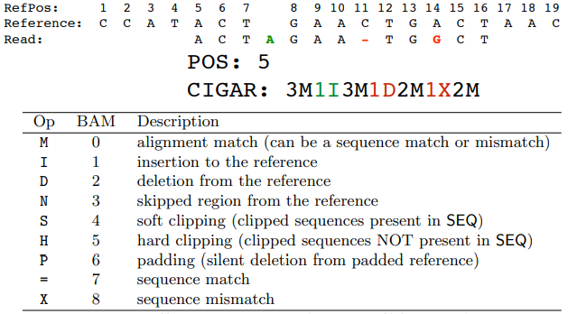

*soft-clipped: bases in 5' and 3' of the read are NOT part of the alignment*
*hard-clipped: bases in 5' and 3' of the read are NOT part of the alignment AND those bases have been removed from the read sequence in the BAM file. The 'real' sequence length would be length(SEQ)+ count-of-hard-clipped-bases*
*Padding is only used for multiple sequence alignment when one wants to add some 'aesthetic' blank characters to get a beautiful visualization.*

---

#### Other interesting NGS data format files

[GFF](https://en.wikipedia.org/wiki/General_feature_format) (General Feature Format), [GTF](https://en.wikipedia.org/wiki/Gene_transfer_format) (Gene Transfer format), [GFF3](https://www.ensembl.org/info/website/upload/gff3.html) or [BED](https://www.ensembl.org/info/website/upload/bed.html) (Browser Extensible Data).

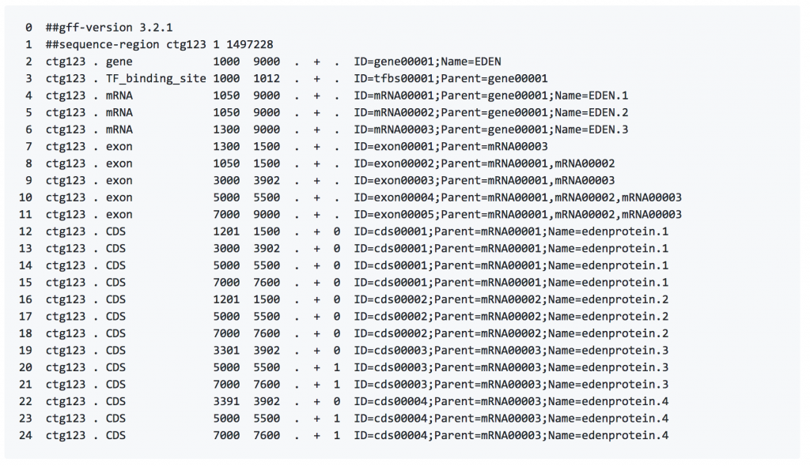

Figure: GFF3 sample file

---

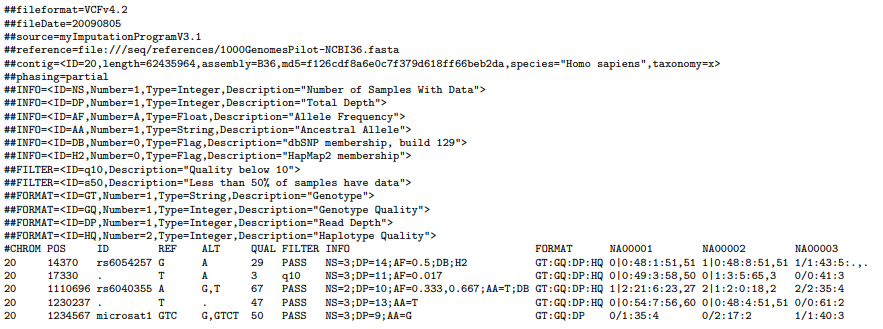

Figure: Variant Call Format (VCF) sample file

---

## Linux Command-Line Interface

### Why we need an Operating System (OS)?

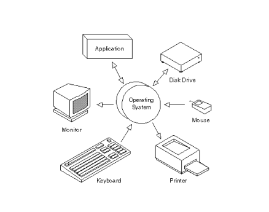

Figure: An operating system (OS) is system software that manages computer hardware and software resources and provides common services for computer programs

*¿Para qué es necesario un sistema operativo?*

---

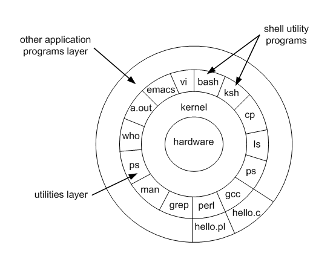

Figure: Linux Layers

*Hardware, kernel, aplicaciones, archivos. Hardware es la estructura física, el kernel el SO que permite interactuar, las aplicaciones son los programas y los archivos es lo que nosotros vemos y analizamos. Estructura por capas de Linux*

---

### Linux Distributions

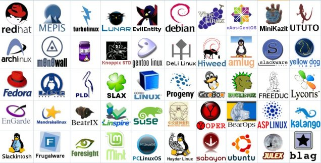

Figure: Ubuntu will be our OS to manage the Hands-on session

*Distribuciones. Ubuntu va a ser la nuestra. Cada una para una necesidad diferente*

---

### Why use Linux for sequencing data?

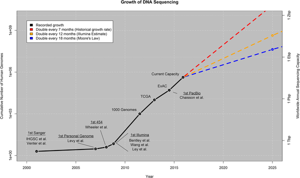

Figure: Growth of DNA Sequencing (Stephens et al. PLoS Biol. 2015)

---

### Why use Linux for sequencing data?

- Thousand of tools that each do simple tasks.
- Preferred development platform for open-source software.
- Free.
- Built for speed, not for comfort.

Some alternatives exist:

- Java / C++ programs. Run on any major operating system.
- Mac OS X is Linux based OS with a very nice GUI.
- Commercial software exist.

*Muchas herramientas para bioinfo, open source, gratis, rapido. Alternativas*

---

### Linux Directory Structure

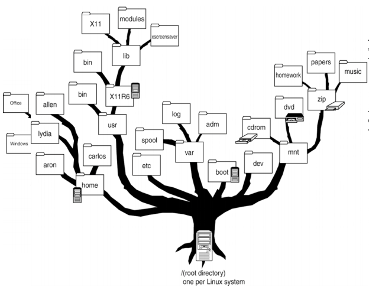

---

### Linux Commands

#### Basic Commands

1. pwd - When you first open the terminal, you are in the home directory of your user.
2. ls - Use this command to know what files are in the directory you are in. You can see all the hidden files by using the command ls -a.
3. cd - Use the "cd" command to go to a directory.
4. mkdir & rmdir - Use the mkdir command when you need to create a folder or a directory. Use rmdir to delete a directory.
5. rm - Use the rm command to delete files and directories. Use rm -r to delete just the directory. It deletes both the folder and the files it contains when using only the rm command.
6. touch - The touch command is used to create a file.
7. man & –help - To know more about a command and how to use it, use the man command.
8. cp - Use the cp command to copy files through the command line.
9. mv - Use the mv command to move files through the command line.
10. locate - The locate command is used to locate a file in a Linux system, just like the search command in Windows.

#### Intermediate Commands

1. echo - If you want to create a new text file or add to an already made text file, you just need to type in echo hello, my name is alok » new.txt.
2. cat - Use the cat command to display the contents of a file. It is usually used to easily view programs.
3. nano, vi, jed - nano and vi are already installed text editors in the Linux command line.
4. sudo - If you want any command to be done with administrative or root privileges, you can use the sudo command.
5. df - Use the df command to see the available disk space in each of the partitions in your system.
6. du - Use du to know the disk usage of a file in your system.
7. tar - Use tar to work with tarballs (or files compressed in a tarball archive) in the Linux command line.
8. zip, unzip - Use zip to compress files into a zip archive, and unzip to extract files from a zip archive.
9. uname - Use uname to show the information about the system your Linux distro is running.