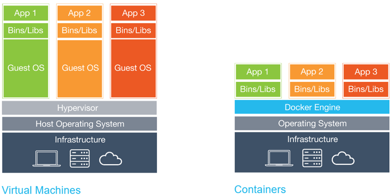

# ADB-02 (hands-on)

**Transcriptome Assembly: Case study of bacteria *Listeria monocytogenes***

*Fernando Pozo*
*Friday, 2nd September, 2022*

---

## Table of Contents

- [ADB-02 (hands-on)](#adb-02-hands-on)
  - [Table of Contents](#table-of-contents)
  - [1. Setting up our working environment](#1-setting-up-our-working-environment)
    - [1.1. Organism of interest: *Listeria monocytogenes*](#11-organism-of-interest-listeria-monocytogenes)
    - [1.2. Sequencing data: How to get it](#12-sequencing-data-how-to-get-it)
    - [1.3. Downloading our samples](#13-downloading-our-samples)
  - [2. How to run this tutorial](#2-how-to-run-this-tutorial)
    - [2.1. First steps with Docker](#21-first-steps-with-docker)
    - [2.2. Configuring our Docker container](#22-configuring-our-docker-container)
    - [2.3. Software Requisites](#23-software-requisites)
  - [3. Data preprocesing](#3-data-preprocesing)
    - [3.1. Quality control with FastQC](#31-quality-control-with-fastqc)
    - [3.2. Analysis of FastQC results](#32-analysis-of-fastqc-results)
    - [3.3. Trimming reads  with Trimmomatic](#33-trimming-reads--with-trimmomatic)
  - [4. Read mapping to a reference genome](#4-read-mapping-to-a-reference-genome)
    - [4.1. Build an index and read mapping with Bowtie 2](#41-build-an-index-and-read-mapping-with-bowtie-2)
    - [4.2. Converting and sorting reads with Samtools](#42-converting-and-sorting-reads-with-samtools)
  - [5. Transcriptome Assembly with Stringtie](#5-transcriptome-assembly-with-stringtie)

---

**Note**

All the links are [clickable](https://github.com/fpozoc/advanced-bioinformatics-course/-/tree/master/ADB-02-ngs-linux/handson). They contain references, databases and interesting sources to know more about our pipeline.

---

## 1. Setting up our working environment

**DNA sequencing** is the process of determining the nucleic acid sequence – the order of nucleotides in DNA. It includes any method or technology that is used to determine the order of the four bases: adenine, guanine, cytosine, and thymine. The advent of rapid DNA sequencing methods has greatly accelerated biological and medical research and discovery.

The massively parallel sequencing technology known as **next-generation sequencing (NGS)** has revolutionized the biological sciences. With its ultra-high throughput, scalability, and speed, NGS enables researchers to perform a wide variety of applications and study biological systems at a level never before possible.

### 1.1. Organism of interest: *Listeria monocytogenes*

For this tutorial, we are going to use data of RNA sequencing from bacteria [*Listeria monocytogenes*](https://www.ncbi.nlm.nih.gov/genome/?term=Listeria+monocytogenes+EGD-e+genome), a food-borne pathogen responsible for listerioris, a sickness with a high mortality rate, which recently leads an [outbreak](https://www.forbes.com/sites/anagarciavaldivia/2019/08/23/health-alert-in-spain-listeriosis-outbreak-affects-168-people/#25662d682680) in Spain.

The genome sequences of several Listeria species have opened a new era in the study of Listeria. These postgenomic studies, comparing pathogenic strains of *L. monocytogenes*, have led to the discovery of new virulence factors. Postgenomic studies have also helped us to understand how Listeria survives in a variety of different environments.
<figure>
<center>

<figcaption><i>L. monocytogenes</i> is one of the most virulent foodborne pathogens</figcaption>
</center>
</figure>

### 1.2. Sequencing data: How to get it

We are going to access **RNA-seq** data from the project called **"Transcriptomic differences between virulence-attenuated and fully-virulent strains of *Listeria monocytogenes*"**, published some weeks ago (2019-07-16), that aims to compare the transcriptomic differences between virulence-attenuated and fully-virulent strains of *L. monocytogenes* under simulated food processing facility conditions. the study ***Listeria monocytogenes* sequencing under simulated food processing facility conditions.**, which is publicy available in SRA (a bioinformatics database that provides a public repository for DNA sequencing data). [SRA reference SRR9691134](https://trace.ncbi.nlm.nih.gov/Traces/sra/?run=SRR9691134).

Our RNA sequencing (RNA-seq) data is stored in a pair of .fastq files (paired-end RNA-seq data [check differences between Single-end vs. paired-end reading](https://systemsbiology.columbia.edu/genome-sequencing-defining-your-experiment)): these files are composed of millions of reads which were run on the [Illumina MiSeq](https://www.illumina.com/documents/products/datasheets/datasheet_miseq.pdf) platform.

We will take as reference the [*Listeria monocytogenes* EGD-e whole genome](https://www.ncbi.nlm.nih.gov/genome/159?genome_assembly_id=159660). As *L. monocytogenes* is a well-studied organism, we will assume that the reference genome and assembly are mostly correct and complete.

It is also important to select a [FASTA sequence](ftp://ftp.ncbi.nlm.nih.gov/genomes/all/GCF/000/196/035/GCF_000196035.1_ASM19603v1/GCF_000196035.1_ASM19603v1_genomic.fna.gz) and a [GFF annotation file](ftp://ftp.ncbi.nlm.nih.gov/genomes/all/GCF/000/196/035/GCF_000196035.1_ASM19603v1/GCF_000196035.1_ASM19603v1_genomic.gff.gz), from the reference genome of our organism. Available in [Genome](https://www.ncbi.nlm.nih.gov/genome/?term=Listeria+monocytogenes+EGD-e+genome).


<figure>
<center><figcaption>Genomic locations in different genomes of <i>Listeria monocytogenes</i>. </figcaption></center>
</figure>

Figure from [Source](https://mbio.asm.org/content/5/2/e00969-14.long).

### 1.3. Downloading our samples

First, please open a terminal session (ALT+t) and create a directory to put the samples and store the results, and giving permissions (r:read, w:write, x:execute):

```bash
mkdir -p ~/SAMPLES
chmod a+rwx ~/SAMPLES
mkdir -p ~/RESULTS
chmod a+rwx ~/RESULTS
```

We can download the RNA-seq data [here](https://trace.ncbi.nlm.nih.gov/Traces/sra/?run=SRR9691134) or typing in a terminal:

```bash
wget -P ~/SAMPLES https://github.com/fpozoc/advanced-bioinformatics-course/-/raw/master/ADB-02-ngs-linux/handson/fastq/SRR9691134_1.fastq.gz
wget -P ~/SAMPLES https://github.com/fpozoc/advanced-bioinformatics-course/-/raw/master/ADB-02-ngs-linux/handson/fastq/SRR9691134_2.fastq.gz
```

and both FASTA sequence and GFF annotation file with:

```bash
wget -P ~/SAMPLES ftp://ftp.ncbi.nlm.nih.gov/genomes/all/GCF/000/196/035/GCF_000196035.1_ASM19603v1/GCF_000196035.1_ASM19603v1_genomic.gff.gz
wget -P ~/SAMPLES ftp://ftp.ncbi.nlm.nih.gov/genomes/all/GCF/000/196/035/GCF_000196035.1_ASM19603v1/GCF_000196035.1_ASM19603v1_genomic.fna.gz
```

uncompressing:

```bash
gunzip ~/SAMPLES/GCF_000196035.1_ASM19603v1_genomic.gff.gz
gunzip ~/SAMPLES/GCF_000196035.1_ASM19603v1_genomic.fna.gz
```

and finally renaming files:

```bash
mv ~/SAMPLES/GCF_000196035.1_ASM19603v1_genomic.fna ~/SAMPLES/lmonocytogenes_genome.fasta
mv ~/SAMPLES/GCF_000196035.1_ASM19603v1_genomic.gff ~/SAMPLES/lmonocytogenes_genome.gff
mv ~/SAMPLES/SRR9691134_1.fastq.gz ~/SAMPLES/lmonocytogenes_read1.fastq.gz
mv ~/SAMPLES/SRR9691134_2.fastq.gz ~/SAMPLES/lmonocytogenes_read2.fastq.gz
```

Visualizing our downloaded samples we should obtain:

<figure>
<center><figcaption>Output of <b>head ~/SAMPLES/lmonocytogenes_genome.fasta</b></figcaption></center>
</figure>

<figure>
<center><figcaption>Output of <b>head -n 10 ~/SAMPLES/lmonocytogenes_genome.gff</b></figcaption></center>
</figure>

<figure>
<center><figcaption>Output of <b>zcat ~/SAMPLES/lmonocytogenes_read1.fastq.gz head -n 10</b></figcaption></center>
</figure>

## 2. How to run this tutorial

Once we have downloaded and stored in ~/SAMPLES/ our FASTQ R1 and R2 files, the FASTA whole genome reference sequence and GFF annotation file, we can run our analysis inside a Docker container.

### 2.1. First steps with Docker

[**Docker**](https://docs.docker.com/get-started/) is a tool designed to make it easier to create, deploy, and run applications by using containers. Containers allow a developer to package up an application with all of the parts it needs, such as libraries and other dependencies, and ship it all out as one package.

<figure>
<center><figcaption>All bioinformatics packages required to run the pipeline will be inside our Docker container</figcaption></center>
</figure>

To use this tutorial, we are going to use an already constructed Docker image. This image contains inside the software required to properly run the analysis.

Please, **open a Linux terminal pressing ALT + t** and type:

```bash
docker -v
```

to check if you have installed Docker in your Linux OS.

Otherwise, you can visit the [Docker installation guide](https://docs.docker.com/install/linux/docker-ce/ubuntu/) to install it locally in your computer.
*Remember that if your don't have administrator privileges you won't be able to install Docker*.

The image we are going to use can be pulled from [dockerhub](https://hub.docker.com/r/osvaldogc/ufv). To get the last image to create our Docker container type in terminal and run:

```bash
docker pull osvaldogc/ufv:2.0
```

Once it has finished, you can list all top level images, their repository and tags, and their size with:

```bash
docker images
```

### 2.2. Configuring our Docker container

With our image already stored in or computer, we are going to declare our variables to define where will be our local and docker folders.

```bash
SAMPLES_LOCAL=~/SAMPLES
SAMPLES_DOCKER=/SAMPLES
RESULTS_LOCAL=~/RESULTS
RESULTS_DOCKER=/RESULTS
```

And finally running running the process in our isolated container:

```bash
docker run --rm  -v $SAMPLES_LOCAL:$SAMPLES_DOCKER -v $RESULTS_LOCAL:$RESULTS_DOCKER -it osvaldogc/ufv:2.0 /bin/bash
```

*NOTE: with -v argument you are going to be able to interact locally with your Docker results in ~/SAMPLES and ~/RESULTS.*

<figure>
<center>

<figcaption>osvaldogc/ufv:2.0 initial screen</figcaption>
</center>
</figure>

And change our path to root:

```bash
cd ..
```

### 2.3. Software Requisites

Remember that all the packages required to run the analysis are already installed in our [Docker image](https://hub.docker.com/r/osvaldogc/ufv). 

Follow this [guide](https://github.com/fpozoc/advanced-bioinformatics-course/-/tree/master/ADB-02-ngs-linux/handson/local_installation) if you want to run your analysis locally.

## 3. Data preprocesing

Data from HTS platforms can contain **adapters** and a variety of **experimental artifacts** and **low-quality data**, so data preprocessing and quality control are neccesary.

### 3.1. Quality control with FastQC

FastQC, written by Simon Andrews of Babraham Bioinformatics, is a program designed to spot potential problems in HTS datasets. It runs a set of analyses on one or more raw sequence files in fastq or bam format and produces a report which summarises the results.

Andrews S. (2010). [*FastQC: a quality control tool for high throughput sequence data.*](https://www.bioinformatics.babraham.ac.uk/projects/fastqc/) Bioinformatics.

Modern high throughput sequencers can generate tens of millions of sequences in a single run. Before analysing this sequence to draw biological conclusions you should always perform some simple quality control checks to ensure that the raw data looks good and there are no problems or biases in your data which may affect how you can usefully use it.

A report with basic statistics, sequence quality, sequence content scores, GC content scores, N content per base, duplication levels, overrepresented sequences, adapter content or kmer content will be given by the software.

To run the initial analysis, please run (*input, output and number of threads are the arguments below*):

```bash
fastqc /SAMPLES/lmonocytogenes_read1.fastq.gz -o /RESULTS -t 4
fastqc /SAMPLES/lmonocytogenes_read2.fastq.gz -o /RESULTS -t 4
```

### 3.2. Analysis of FastQC results

Report analysis could be completely covered following the [FastQC manual](https://dnacore.missouri.edu/PDF/FastQC_Manual.pdf). Therefore, checking our html and zip files with images and reports is going to give us an idea about the quality of the sequencing.

<figure>
<center>

<figcaption><i>lmonocytogenes_read1.fastq</i> quality per base
</figcaption>
</center>
</figure>

The most common types of quality control and procedures are:

- **Per-base quality**: Trim ends if quality too low.
- **Per sequence quality**: Average quality score should be well above 25-30, otherwise experiment may need to be repeated.
- **Sequence duplication levels**: A large number of identical sequence may indicate duplication by PCR during library preparation, this can bias estimates of mRNA expression and is often filtered out.
- **Overrepresented sequences**: Sometimes adapter sequences are represented in final sequences and these need to be filtered out before analysis.

This view shows an overview of the range of quality values across all bases at each position in the FastQ file. The quality seems to be enough to continue the analysis (the scope of this tutorial is not shown an extensive analysis of this step), but above we have shown that QC could be optimize following these procedures.

### 3.3. Trimming reads  with Trimmomatic

Trimmomatic is an efficient preprocessing tool, which could correctly handle paired-end data, that can be used to trim and crop Illumina (FASTQ) data as well as to remove adapters.

Bolger AM, Lohse M, Usadel B. (2014) [*Trimmomatic: a flexible trimmer for Illumina sequence data*](https://academic.oup.com/bioinformatics/article/30/15/2114/2390096). Bioinformatics.

NGS sequencing typically results in millions of reads. A proportion of these reads will contain **artifacts** or **low-quality** bases which we would like to **remove** before starting our analyses.

Trimmomatic performs a variety of useful trimming tasks for Illumina Paired-End (and also Single-End) data. The selection of trimming steps and their associated parameters are supplied on the command line.

*NOTE*: If you want to know which adaptors are in your data, the easiest is probably to ask lab person that generated the data. What you will usually observe with Illumina is indexed adaptor at the beginning of your F reads (plus sometimes some fake polyA stretches) and universal adaptor at the end of your R reads. I would recommend reading pages 5 and 6 in Trimmomatic [user guide](http://www.usadellab.org/cms/uploads/supplementary/Trimmomatic/TrimmomaticManual_V0.32.pdf) to know more about which types of adaptors could be in your data.

As we don't know with detail how the experiment was performed, For this tutorial, we are going to use one indexed and one universal adaptor, only as a toy sample, in order to show how to trim adaptors with Trimmomatic.

To automatically create a file with the content below, please type in the terminal:

```bash
printf ">PrefixAdapter7/1
GATCGGAAGAGCACACGTCTGAACTCCAGTCACCAGATCATCTCGTATGCCGTCTTCTGCTTG
>PrefixUniversal/2
AGATCGGAAGAGCGTCGTGTAGGGAAAGAGTGTAGATCTCGGTGGTCGCCGTATCATT"
> /SAMPLES/illumina_adapter.fasta
```

We are going to use the next arguments to run our analysis:

- ILLUMINACLIP: Cut adapter and other illumina-specific sequences from the read.
- SLIDINGWINDOW: Performs a sliding window trimming approach. It starts. Scanning at the 5' end and clips the read once the average quality within the window falls below a threshold.
- LEADING: Cut bases off the start of a read, if below a threshold quality-
- TRAILING: Cut bases off the end of a read, if below a threshold quality-
- MINLEN: Drop the read if it is below a specified length-

And run Trimmomatic with the command:

```bash
java -jar /SOFTWARE/trimmomatic/bin/trimmomatic.jar PE -phred33 \
/SAMPLES/lmonocytogenes_read1.fastq.gz \
/SAMPLES/lmonocytogenes_read2.fastq.gz \
/RESULTS/lmonocytogenes_read1_paired.fastq \
/RESULTS/lmonocytogenes_read1_unpaired.fastq \
/RESULTS/lmonocytogenes_read2_paired.fastq \
/RESULTS/lmonocytogenes_read2_unpaired.fastq \
ILLUMINACLIP:/SAMPLES/illumina_adapter.fasta:2:33:20:2:true \
LEADING:36 \
TRAILING:32 \
SLIDINGWINDOW:4:30 \
MINLEN:3
```

Again, we can then run the FastQC analysis again to see if we have fixed some things we saw previously.

```bash
fastqc /RESULTS/lmonocytogenes_read1_paired.fastq -o /RESULTS -t 4
fastqc /RESULTS/lmonocytogenes_read2_paired.fastq -o /RESULTS -t 4
```

## 4. Read mapping to a reference genome

After we check to make sure that our raw reads are OK, we are going to construct our index and map the reads to our reference genome with Bowtie2.

### 4.1. Build an index and read mapping with Bowtie 2

**Bowtie 2** is an ultrafast and memory-efficient tool for aligning sequencing reads to long reference sequences. It is particularly good at aligning reads of about 50 up to 100s or 1,000s of characters. Bowtie 2 indexes the genome with an [FM Index](https://en.wikipedia.org/wiki/FM-index). Bowtie2 supports gapped, local, and paired-end alignment modes.

Langmead B, Salzberg S. (2012) [*Fast gapped-read alignment with Bowtie 2*](https://www.nature.com/articles/nmeth.1923). Nature Methods

We create a Bowtie 2 index in order to map efficiently million of reads to the reference FASTA sequence:

```bash
bowtie2-build /SAMPLES/lmonocytogenes_genome.fasta /RESULTS/lmonocytogenes_genome
```

Once we have built the index, we have to tell Bowtie 2 where to find these index files:

```bash
export BOWTIE2_INDEXES=/RESULTS
```

And then, map our reads to *L. monocytogenes* reference, which result in a .SAM file.

```bash
bowtie2 -x /RESULTS/lmonocytogenes_genome -p 2 -1 /RESULTS/lmonocytogenes_read1_paired.fastq -2 /RESULTS/lmonocytogenes_read2_paired.fastq -S /RESULTS/lmonocytogenes_genome.sam
```

<figure>
<center>

<figcaption>Output of <b>head -n 20 lmonocytogenes_genome.sam | less -S</b>
</figcaption>
</center>
</figure>

### 4.2. Converting and sorting reads with Samtools

[Samtools](http://www.htslib.org/) is a suite of programs for interacting with high-throughput sequencing data. With Samtools we are going to be able to perform some operations like reading, writing/editing, indexing, viewing SAM/BAM/CRAM format files.

Li H, Durbin R. (2009) [The Sequence Alignment/Map format and SAMtools](https://academic.oup.com/bioinformatics/article/25/16/2078/204688). Bioinformatics.

In our Docker container, there are 2 different versions of Samtools. We have to use Samtools 1.9, and therefore, we have to export the right path to our environment with:

```bash
export PATH=/SOFTWARE/samtools-1.9:$PATH
```

And converting our SAM file to BAM and sorting it. [Here](https://wikis.utexas.edu/display/CoreNGSTools/Samtools%3A+viewing%2C+counting+and+sorting+your+alignment+data) you can find a nice explanation of the objective of convert and sort your alignment data.

```bash
samtools view -Su /RESULTS/lmonocytogenes_genome.sam > /RESULTS/lmonocytogenes_genome.bam
samtools sort /RESULTS/lmonocytogenes_genome.bam -o /RESULTS/lmonocytogenes_genome_sorted.bam
```

## 5. Transcriptome Assembly with Stringtie

[**StringTie**](https://github.com/gpertea/stringtie) is a fast and highly efficient assembler of RNA-Seq alignments into potential transcripts.

Pertea M, Salzberg S. (2015) [*StringTie enables improved reconstruction of a transcriptome from RNA-seq reads.*](https://www.nature.com/articles/nbt.3122) Nature Biotechnology

The main **input** of the program is a SAMTools BAM file with RNA-Seq mappings sorted by genomic location

The main **output** of the program is a GTF file containing the structural definitions of the transcripts assembled by StringTie from the read alignment data. 

<figure>
<center>

<figcaption>Overview of the flow of the StringTie algorithm
</figcaption>
</center>
</figure>

To run *stringtie* and finish our analysis, please type in your Docker terminal:

```bash
stringtie /RESULTS/lmonocytogenes_genome_sorted.bam -G /SAMPLES/lmonocytogenes_genome.gff -o /RESULTS/stringtie_all_output.gtf -A /RESULTS/stringtie_cov_output.gtf
```

And finally, explore your results with:

```bash
ls -lh
```

<figure>
<center>

<figcaption>Results of our hands-on
</figcaption>
</center>
</figure>