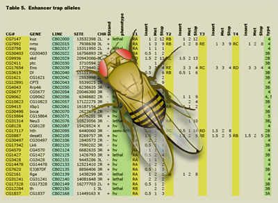
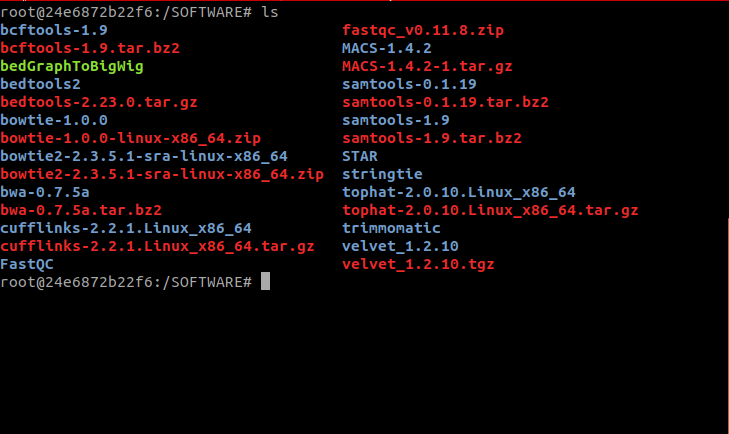

# ADB-07 (hands-on)

**RNA-seq**

*Fernando Pozo*
*Monday, 5th September, 2022*

---

## Table of Contents

- [ADB-07 (hands-on)](#adb-07-hands-on)
  - [Table of Contents](#table-of-contents)
  - [1. Setting up our working environment](#1-setting-up-our-working-environment)
    - [1.1. Organism of interest: *Droshophila melanogaster*](#11-organism-of-interest-droshophila-melanogaster)
    - [1.2. Sequencing data: How to get it](#12-sequencing-data-how-to-get-it)
    - [1.3. Downloading our samples](#13-downloading-our-samples)
  - [2. How to run this tutorial](#2-how-to-run-this-tutorial)
    - [2.1. First steps with Docker](#21-first-steps-with-docker)
    - [2.2. Configuring our Docker container](#22-configuring-our-docker-container)
  - [3. Exercise 1: Mapping a toy transcriptome](#3-exercise-1-mapping-a-toy-transcriptome)
  - [3. Exercise 2: Reproducing an experiment](#3-exercise-2-reproducing-an-experiment)

---

**Note**

All the links are [clickable](https://github.com/fpozoc/advanced-bioinformatics-course/-/tree/master/ADB-02-ngs-linux/handson). They contain references, databases and interesting sources to know more about our pipeline.

---

## 1. Setting up our working environment

**RNA-Seq** is a particular technology-based sequencing technique which uses next-generation sequencing (NGS) to reveal the presence and quantity of RNA in a biological sample at a given moment, analyzing the continuously changing cellular transcriptome. The massively parallel sequencing technology known as **next-generation sequencing (NGS)** has revolutionized the biological sciences. With its ultra-high throughput, scalability, and speed, NGS enables researchers to perform a wide variety of applications and study biological systems at a level never before possible.

### 1.1. Organism of interest: *Droshophila melanogaster*

For this tutorial, we are going to use data of RNA sequencing from bacteria [*Drosophila melanogaster*](https://www.ncbi.nlm.nih.gov/Taxonomy/Browser/wwwtax.cgi?mode=Info&id=7227),is a species of fly (the taxonomic order Diptera) in the family Drosophilidae. The species is known generally as the common fruit fly or vinegar fly, typically used in research owing to its rapid life cycle, relatively simple genetics with only four pairs of chromosomes, and large number of offspring per generation.

The genome of D. *melanogaster* (sequenced in 2000, and curated at the [FlyBase](https://flybase.org/) database) contains four pairs of chromosomes. The fourth chromosome is so tiny, it is often ignored, aside from its important eyeless gene. The D. *melanogaster* sequenced genome of 139.5 million base pairs has been annotated and contains around 15,682 genes according to Ensemble release 73. More than 60% of the genome appears to be functional non-protein-coding DNA involved in gene expression control. Determination of sex in Drosophila occurs by the X:A ratio of X chromosomes to autosomes, not because of the presence of a Y chromosome as in human sex determination. Although the Y chromosome is entirely heterochromatic, it contains at least 16 genes, many of which are thought to have male-related functions.

<figure>
<center>

<figcaption><i>D. melanogaster</i> shares so many genes with humans</figcaption>
</center>
</figure>

[Figure reference](https://www2.lbl.gov/Science-Articles/Archive/sabl/2007/Feb/drosophila.html)

### 1.2. Sequencing data: How to get it

We are going to access **RNA-seq** data from the project called **"Differential Gene and Transcript Expression Analysis with TopHat and Cufflinks"**, published  on Sep 10, 2011. This submission includes the sample data for a protocol covering differential expression analysis with TopHat and Cufflinks. The protocol also covers several accessory tools and utilities that aid in managing data, including CummeRbund, a tool for visualizing RNA-Seq analysis results. While the procedure assumes basic informatics skills, these tools assume little to no background with RNA-Seq analysis and are meant for novices and experts alike. The protocol begins with raw sequencing reads and produces a transcriptome assembly, lists of differentially expressed and regulated genes and transcripts, and publication-quality visualizations of analysis results.
- [GEO accession reference: GSE32038](https://www.ncbi.nlm.nih.gov/geo/query/acc.cgi?acc=GSE32038).
- Nature protocols original publication: Trapnell, C., Roberts, A., Goff, L. et al. Differential gene and transcript expression analysis of RNA-seq experiments with TopHat and Cufflinks. Nat Protoc 7, 562–578 (2012). https://doi.org/10.1038/nprot.2012.016

It is also important to select a [FASTA sequence](ftp://ftp.ensembl.org/pub/release-90/fasta/drosophila_melanogaster/dna//Drosophila_melanogaster.BDGP6.dna.toplevel.fa.gz) and a [GTF annotation file](ftp://ftp.ensembl.org/pub/release-90/gtf/drosophila_melanogaster//Drosophila_melanogaster.BDGP6.90.gtf.gz), from the reference genome of our organism.

### 1.3. Downloading our samples

First, please open a terminal session (ALT+t) and create a directory to put the samples and store the results, and giving permissions (r:read, w:write, x:execute):

```bash
mkdir -p ~/SAMPLES
chmod a+rwx ~/SAMPLES
mkdir -p ~/RESULTS
chmod a+rwx ~/RESULTS
```

Downloading the preprocessed files that will be neccessary to be more confortable with the practise.

```sh
wget --output-document ~/SAMPLES/diff_out_C1_C2.tar.gz https://github.com/fpozoc/advanced-bioinformatics-course/-/raw/master/ADB-07-rna-seq/hands-on/data/diff_out_C1_C2.tar.gz
wget --output-document ~/SAMPLES/sample.tar.gz https://github.com/fpozoc/advanced-bioinformatics-course/-/raw/master/ADB-07-rna-seq/hands-on/data/sample.tar.gz
```

and uncompressing:

```sh
tar -xf ~/SAMPLES/diff_out_C1_C2.tar.gz -C ~/SAMPLES
tar -xf ~/SAMPLES/sample.tar.gz -C ~/SAMPLES
```

## 2. How to run this tutorial

Once we have downloaded and stored in ~/SAMPLES/ our FASTQ R1 and R2 files, the FASTA whole genome reference sequence and GFF annotation file, we can run our analysis inside a Docker container.

### 2.1. First steps with Docker

[**Docker**](https://docs.docker.com/get-started/) is a tool designed to make it easier to create, deploy, and run applications by using containers. Containers allow a developer to package up an application with all of the parts it needs, such as libraries and other dependencies, and ship it all out as one package.

<figure>
<center><figcaption>All bioinformatics packages required to run the pipeline will be inside our Docker container</figcaption></center>
</figure>

To use this tutorial, we are going to use an already constructed Docker image. This image contains inside the software required to properly run the analysis.

Please, **open a Linux terminal pressing ALT + t** and type:

```bash
docker -v
```

to check if you have installed Docker in your Linux OS.

Otherwise, you can visit the [Docker installation guide](https://docs.docker.com/install/linux/docker-ce/ubuntu/) to install it locally in your computer.
*Remember that if your don't have administrator privileges you won't be able to install Docker*.

The image we are going to use can be pulled from [dockerhub](https://hub.docker.com/r/osvaldogc/ufv). To get the last image to create our Docker container type in terminal and run:

```bash
docker pull osvaldogc/ufv:2.0
```

Once it has finished, you can list all top level images, their repository and tags, and their size with:

```bash
docker images
```

### 2.2. Configuring our Docker container

With our image already stored in or computer, we are going to declare our variables to define where will be our local and docker folders.

```bash
SAMPLES_LOCAL=~/SAMPLES/
SAMPLES_DOCKER=/SAMPLES
RESULTS_LOCAL=~/RESULTS/
RESULTS_DOCKER=/RESULTS
```

And finally running running the process in our isolated container:

```bash
docker run --rm  -v $SAMPLES_LOCAL:$SAMPLES_DOCKER -v $RESULTS_LOCAL:$RESULTS_DOCKER -it osvaldogc/ufv:2.0 /bin/bash
```

*NOTE: with -v argument you are going to be able to interact locally with your Docker results in ~/SAMPLES and ~/RESULTS.*

<figure>
<center>

<figcaption>osvaldogc/ufv:2.0 initial screen</figcaption>
</center>
</figure>

And change our path to root:

```bash
cd ..
```

## 3. Exercise 1: Mapping a toy transcriptome

First, we are going to map our toy reads against a reference chromosome. We will use TopHat, which has already been installed in our Docker image.

[TopHat](https://ccb.jhu.edu/software/tophat/index.shtml) is a fast splice junction mapper for RNA-Seq reads. It aligns RNA-Seq reads to mammalian-sized genomes using the ultra high-throughput short read aligner Bowtie, and then analyzes the mapping results to identify splice junctions between exons.

```sh
tophat -p 1 -o /RESULTS/exp1 /SAMPLES/HS.chr14 /SAMPLES/rawReads1.fastq
tophat -p 1 -o /RESULTS/exp2 /SAMPLES/HS.chr14 /SAMPLES/rawReads2.fastq
```

[Cufflinks](http://cole-trapnell-lab.github.io/cufflinks/) assembles transcripts, estimates their abundances, and tests for differential expression and regulation in RNA-Seq samples. It accepts aligned RNA-Seq reads and assembles the alignments into a parsimonious set of transcripts. Cufflinks then estimates the relative abundances of these transcripts based on how many reads support each one, taking into account biases in library preparation protocols.

```sh
cufflinks -p 1 -o /RESULTS/exp1 RESULTS/exp1/accepted_hits.bam
cufflinks -p 1 -o /RESULTS/exp2 RESULTS/exp2/accepted_hits.bam
```

[Cuffcompare](http://cole-trapnell-lab.github.io/cufflinks/cuffcompare/) is a Cufflinks program to compare your assembled transcripts to a reference annotation, and to track Cufflinks transcripts across multiple experiments (e.g. across a time course). Then, we create the directory `compare` and run the program with the commands below.

```sh
mkdir -p /RESULTS/compare
cd /RESULTS/compare
cuffcompare -r /SAMPLES/HS.chr14.gtf /RESULTS/exp1/transcripts.gtf /RESULTS/exp2/transcripts.gtf
```

[Cuffdiff](http://cole-trapnell-lab.github.io/cufflinks/cuffdiff/) intends to find significant changes in transcript expression, splicing, and promoter use. From the command line, run cuffdiff as follows:

```sh
cuffdiff -L exp1,exp2 -c 200 -o /RESULTS/diff_out /RESULTS/compare/cuffcmp.combined.gtf /RESULTS/exp1/accepted_hits.bam /RESULTS/exp2/accepted_hits.bam
```

## 3. Exercise 2: Reproducing an experiment

[Differential gene and transcript expression analysis of RNA-seq experiments with TopHat and Cufflinks](https://www.nature.com/articles/nprot.2012.016#citeas)

In order to optimise the time, step 1 (Align the RNA-seq reads to the genome) and step 2 (Assemble expressed genes and transcripts) has been already generated.

Then, download both reference and fasta file.

```sh
curl ftp://ftp.ensembl.org/pub/release-90/fasta/drosophila_melanogaster/dna//Drosophila_melanogaster.BDGP6.dna.toplevel.fa.gz | gunzip > ~/SAMPLES/Drosophila_melanogaster.BDGP6.dna.toplevel.fa
curl ftp://ftp.ensembl.org/pub/release-90/gtf/drosophila_melanogaster//Drosophila_melanogaster.BDGP6.90.gtf.gz | gunzip > ~/SAMPLES/Drosophila_melanogaster.BDGP6.90.gtf
```

Create a file called assemblies.txt that lists the assembly file for each sample.

```sh
echo $'/SAMPLES/GSM794483_C1_R1.transcripts.gtf\n/SAMPLES/GSM794484_C1_R2.transcripts.gtf\n/SAMPLES/GSM794485_C1_R3.transcripts.gtf\n/SAMPLES/GSM794486_C2_R1.transcripts.gtf\n/SAMPLES/GSM794487_C2_R2.transcripts.gtf\n/SAMPLES/GSM794488_C2_R3.transcripts.gtf' > ~/RESULTS/assemblies.txt
```

Identify differentially expressed genes and transcripts

```sh
cuffmerge -g /SAMPLES/Drosophila_melanogaster.BDGP6.90.gtf -s /SAMPLES/Drosophila_melanogaster.BDGP6.dna.toplevel.fa -p 8 /RESULTS/assemblies.txt
```

```sh
cuffdiff /merged_asm/merged.gtf /SAMPLES/GSM794483_C1_R1.accepted_hits.bam,/SAMPLES/GSM794484_C1_R2.accepted_hits.bam,/SAMPLES/GSM794485_C1_R3.accepted_hits.bam /SAMPLES/GSM794486_C2_R1.accepted_hits.bam,/SAMPLES/GSM794487_C2_R2.accepted_hits.bam,/SAMPLES/GSM794488_C2_R3.accepted_hits.bam --labels C1,C2 -b /SAMPLES/Drosophila_melanogaster.BDGP6.dna.toplevel.fa -p 8 -o /RESULTS/diff_out_C1_C2
```

Execute R

```sh
R
```

```R
library(cummeRbund)
cuff_data <- readCufflinks('/RESULTS/diff_out_C1_C2')
cuff_data
```

[CummeRbund](https://www.bioconductor.org/packages/release/bioc/html/cummeRbund.html) plots of the expression level distribution for all genes in simulated experimental conditions C1 and C2.

```R
pdf(file="/RESULTS/density.pdf")
csDensity(genes(cuff_data))
dev.off()
```

CummeRbund scatter plots highlight general similarities and specific outliers between conditions C1 and C2.

```R
pdf(file="/RESULTS/scatterplot.pdf")
csScatter(genes(cuff_data), 'C1', 'C2')
dev.off()
```

CummeRbund volcano plots reveal genes, transcripts, TSS groups or CDS groups that differ significantly between the pairs of conditions C1 and C2. 

```R
pdf(file="/RESULTS/volcano.pdf")
csVolcano(genes(cuff_data), 'c1', 'c2')
dev.off()
```

Differential analysis results for XLOC_000881.

```R
mygene <- getGene(cuff_data, 'XLOC_000881')

pdf(file="/RESULTS/XLOC_000881.pdf")
expressionBarplot(mygene)
dev.off()
```

Plot individual isoform expression levels of selected genes of interest with bar plots.

```R
pdf(file="/RESULTS/XLOC_000881.pdf")
expressionBarplot(isoforms(mygene))
dev.off()
```

Record differentially expressed genes and transcripts to files for use in downstream analysis (optional). You can use CummeRbund to quickly inspect the number of genes and transcripts that are differentially expressed between two samples. The R code below loads the results of Cuffdiff's analysis and reports the number of differentially expressed genes:

```R
gene_diff_data <- diffData(genes(cuff_data))
sig_gene_data <- subset(gene_diff_data, (significant == 'yes'))
nrow(sig_gene_data)
write.table(sig_gene_data, '/RESULTS/diff_genes.txt', sep='\t', row.names = F, col.names = T, quote = F)
```

Similar snippets can be used to extract differentially expressed transcripts or differentially spliced and regulated genes:

```R
isoform_diff_data <- diffData(isoforms(cuff_data), 'C1', 'C2')
sig_isoform_data <- subset(isoform_diff_data, (significant == 'yes'))
nrow(sig_isoform_data)
tss_diff_data <- diffData(TSS(cuff_data), 'C1', 'C2')
sig_tss_data <- subset(tss_diff_data, (significant == 'yes'))
nrow(sig_tss_data)
cds_diff_data <- diffData(CDS(cuff_data), 'C1', 'C2')
sig_cds_data <- subset(cds_diff_data, (significant == 'yes'))
nrow(sig_cds_data)
promoter_diff_data <- distValues(promoters(cuff_data))
sig_promoter_data <- subset(promoter_diff_data, (significant == 'yes'))
nrow(sig_promoter_data)
splicing_diff_data <- distValues(splicing(cuff_data))
sig_splicing_data <- subset(splicing_diff_data, (significant == 'yes'))
nrow(sig_splicing_data)
relCDS_diff_data <- distValues(relCDS(cuff_data))
sig_relCDS_data <- subset(relCDS_diff_data, (significant == 'yes'))
nrow(sig_relCDS_data)
```

```R
sessionInfo()
```

```
R version 3.0.2 (2013-09-25)
Platform: x86_64-apple-darwin10.8.0 (64-bit)

locale:
[1] en_US.UTF-8/en_US.UTF-8/en_US.UTF-8/C/en_US.UTF-8/en_US.UTF-8

attached base packages:
[1] grid      parallel  stats     graphics  grDevices utils     datasets
[8] methods   base

other attached packages:
 [1] cummeRbund_2.4.1     Gviz_1.6.0           rtracklayer_1.22.0  
 [4] GenomicRanges_1.14.4 XVector_0.2.0        IRanges_1.20.6
 [7] fastcluster_1.1.13   reshape2_1.2.2       ggplot2_0.9.3.1
[10] RSQLite_0.11.4       DBI_0.2-7            BiocGenerics_0.8.0  

loaded via a namespace (and not attached):
 [1] AnnotationDbi_1.24.0   Biobase_2.22.0         biomaRt_2.18.0
 [4] Biostrings_2.30.1      biovizBase_1.10.7      bitops_1.0-6
 [7] BSgenome_1.30.0        cluster_1.14.4         colorspace_1.2-4
[10] dichromat_2.0-0        digest_0.6.4           Formula_1.1-1
[13] GenomicFeatures_1.14.2 gtable_0.1.2           Hmisc_3.13-0
[16] labeling_0.2           lattice_0.20-24        latticeExtra_0.6-26
[19] MASS_7.3-29            munsell_0.4.2          plyr_1.8
[22] proto_0.3-10           RColorBrewer_1.0-5     RCurl_1.95-4.1
[25] Rsamtools_1.14.2       scales_0.2.3           splines_3.0.2
[28] stats4_3.0.2           stringr_0.6.2          survival_2.37-4
[31] tools_3.0.2            XML_3.95-0.2           zlibbioc_1.8.0
```
