# ADB-07-ngs-linux (theory and notes)

**RNA-seq**

*Fernando Pozo*

*Monday, 7th September, 2020*

---

## Table of Contents

- [Introduction to RNA-seq](#introduction-to-rna-seq)
  * [Central Dogma of Molecular Biology](#central-dogma-of-molecular-biology)
  * [RNA-seq overview](#rna-seq-overview)
  * [Alternative Splicing](#alternative-splicing)
  * [Genome output: RNA-seq](#genome-output--rna-seq)
  * [Why is cDNA used in RNA seq?](#why-is-cdna-used-in-rna-seq-)
  * [RNA-seq Applications](#rna-seq-applications)
  * [RNA-seq Workflow](#rna-seq-workflow)
  * [Brief Introduction to Microarrays](#brief-introduction-to-microarrays)
    + [Microarrays vs. RNA-seq](#microarrays-vs-rna-seq)
  * [How to measure the expression?](#how-to-measure-the-expression-)
- [Experimental Design](#experimental-design)
  * [Overview](#overview)
  * [Experimental Objectives](#experimental-objectives)
  * [Experimental Complexity](#experimental-complexity)
  * [RNA-seq best practices](#rna-seq-best-practices)
- [Library Preparation](#library-preparation)
- [Sequencing](#sequencing)
- [Data Analysis](#data-analysis)
  * [RNA-seq: workflow](#rna-seq--workflow)
  * [RNA-seq file formats](#rna-seq-file-formats)
  * [RNA-seq: alignment](#rna-seq--alignment)
  * [RNA-seq: assembly](#rna-seq--assembly)
  * [RNA-seq: transcriptome assembly with Cufflinks](#rna-seq--transcriptome-assembly-with-cufflinks)
  * [RNA-seq: Differential gene/isoform expression](#rna-seq--differential-gene-isoform-expression)
  * [RNA-seq: Methods summary](#rna-seq--methods-summary)
- [Conclusions](#conclusions)

---

# Introduction to RNA-seq

## Central Dogma of Molecular Biology

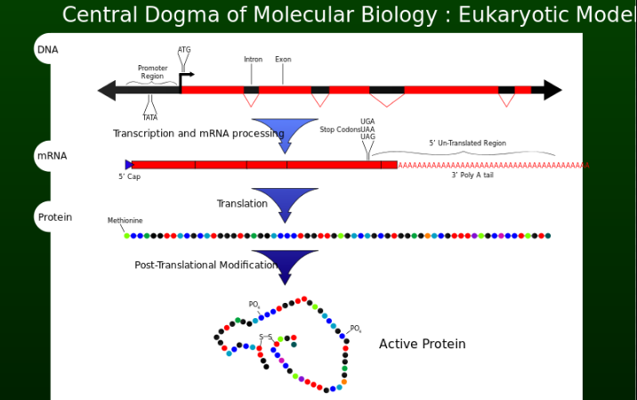

*El dogma central de la biología molecular representa el flujo de información genética en un sistema biológico. DNA->RNA->Proteína. Propuesto por Francis Crick (1957). Definir un mapa preciso de todos los genes a lo largo de distintos tipos celulares es crítico para el entendimiento de la biología. Existen varios niveles a partir de cual podemos explorar el estado genómico de una célula: por un lado, a nivel de secuencia (mutaciones), a nivel de transcriptoma (expresión) y a nivel de epigenoma (silenciamiento de genes).*

---

## RNA-seq overview

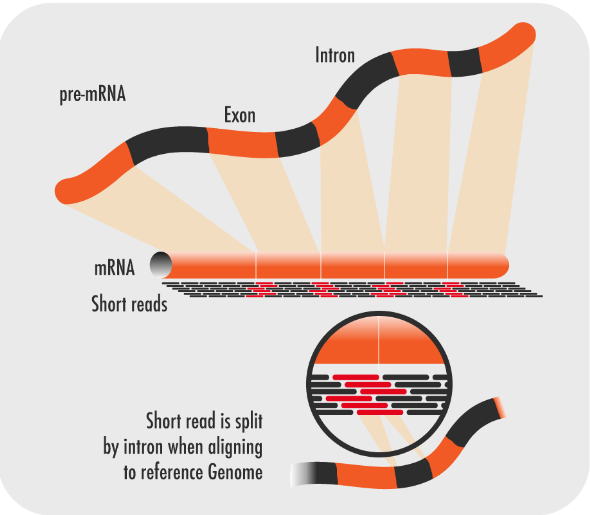

*[Figure reference](https://www.technologynetworks.com/genomics/articles/rna-seq-basics-applications-and-protocol-299461)*

---

## Alternative Splicing

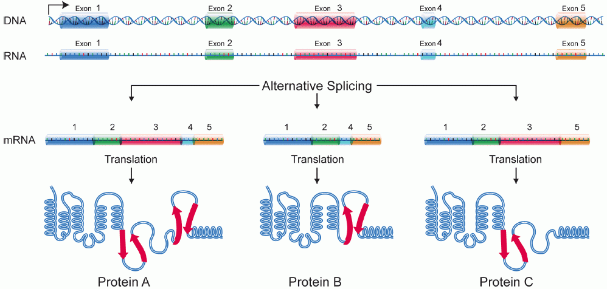

*El corte y empalme alternativo (Alternative Splicing) o splicing alternativo, permite obtener a partir de un transcrito primario de ARNm o pre-ARNm distintas isoformas de ARNm y proteínas, las cuales PUEDEN tener funciones diferentes y a menudo opuestas. Este proceso ocurre principalmente en eucariotas, aunque también puede observarse en virus. Muchos genes están empalmados alternativamente en formas específicas de tejidos, reguladas en el desarrollo y en respuesta a hormonas, proporcionando un mecanismo adicional para la regulación de la expresión génica.  Al transcribirse el ADN a ARNm se obtiene un transcrito primario de ARN o pre-ARNm que abarca intrones y exones.​ Para que este pre-ARNm de lugar a un ARNm debe sufrir un proceso de maduración del ARNm, que consiste, básicamente, en eliminar todos los intrones. Sin embargo los intrones y exones no siempre están determinados durante el proceso de ayuste.  La selección de los sitios de ayuste se lleva a cabo por residuos de serina/arginina de ciertas proteínas conocidas como proteínas SR. Un hallazgo crítico con respecto a la prevalencia de splicing alternativo fue que la mayoría de los genes humanos producen una amplia variedad de ARNm que a su vez se estima que podrían codificar proteínas distintas. Aún no está del todo claro que impacto funcional puede tener a nivel proteína este mecanismo.*

*Se va a aislar el RNA de cada una de estas muestras por separado, fragmentar y amplificar. Esta información la mapearemos a genoma y transcriptoma de referencia. Los cambios que podamos encontrar entre las dos condiciones, nos van a dar pista de qué procesos están teniendo lugar y cómo revertirlos. Por ejemplo.*

*El resultado va a ser una matriz de cuentas*

---

## Genome output: RNA-seq

RNA-seq can reveal new genes, splice variants and quantify expression genome-wide in a single assay.

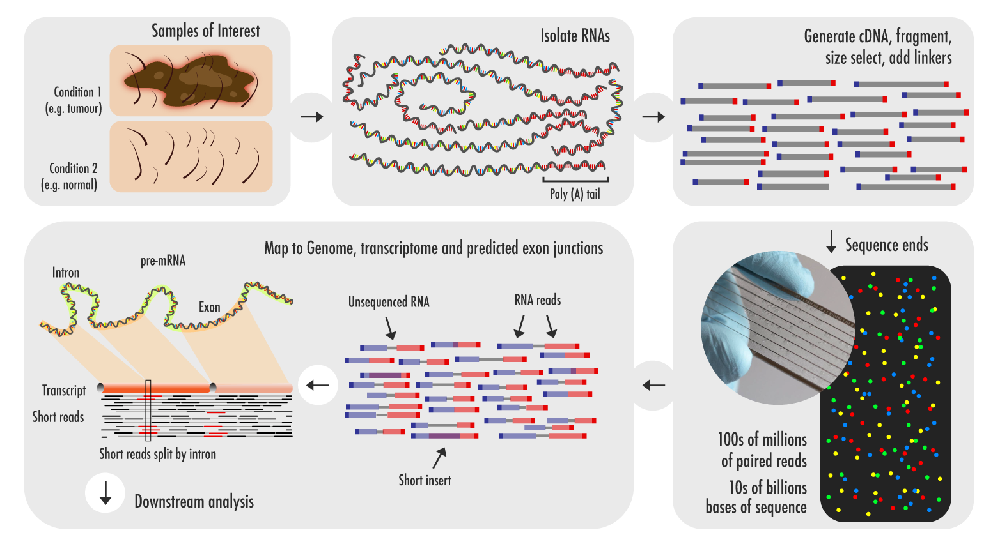

[video: Illumina Sequencing by Synthesis](https://www.youtube.com/watch?v=fCd6B5HRaZ8&feature=youtu.be&ab_channel=Illumina)

*El RNA-seq o la secuenciación de ARN, utiliza la secuenciación masiva (NGS) para revelar la presencia y cantidad de ARN de una muestra biológica en un momento dado. Así, se emplea para analizar los cambios en el transcriptoma.*
*El esquema del protocolo es el siguiente:*
*1. Se aisla el RNA. Durante este proceso, vamos a partir de nuestras muestras de interés (por ejemplo, tumor y control normal). Estas muestras serán aisladas del tejido y mezcladas con una deoxyribonucleasa (DNAsa). La dnase reducirá la cantidad de DNA genómico existente en la muestra. Durante este proceso se medirá la degradación del RNA mediante electroforesis y esta información se tendrá en cuenta para definir la integridad de la muestra. Además, también se va a medir la cantidad de RNA de la que se parte, que se tendrá en cuenta durante el paso de preparación de librería.*
*2. El siguiente paso consiste en el filtrado o selección del RNA con el que nos hemos quedado. Con el RNA obtenido, podemos hacer varias cosas. Podemos quedárnoslo tal cual o filtrarlo mediante colas poli A (colas poliadeniladas en el extremo 3’) con el fin de incluir exclusivamente rna mensajero y separarlo del ribosomal). Existen otras técnicas de filtrado para unir secuencias de interés.) El caso es que los RNA que tienen colas 3’ poliA son secuencias codificantes maduras y procesadas. Este filtrado se realiza mediante la unión con oligómeros poli-T que se encuentran covalentemente unidos a un sustrato, generalmente “perlas magnéticas”. Este tipo de selección tiene sus inconvinienes, ya que ignora RNAs no codificantese introduce un sesgo hacia 3’. Estos inconvenientes se pueden subsanar utilizando otra metodología que consiste en la eliminación del RNA ribosomal. El rRNA se suele eliminar poque supone más de un 90% del RNA que existe en la célula. Mantenerlo significaría diluir información importante a nivel de transcripción de mensajero.*
*3. Una vez hayamos seleccionado los fragmentos de RNA que más nos gustan, pasaremos a la síntesis de cDNA. El RNA se retrotranscribe a cDNA ya que este es mucho más estable y para facilitar la amplificación mediante el uso de la DNA polimerasa.*
*4. cDNA synthesis: El RNA se retrotranscribe a cDNA ya que este es mucho más estable y para facilitar la amplificación mediante el uso de la DNA polimerasa.  La amplificación que se hace después de la retrotranscripción implica la pérdida del sentido de las hebras, esto puede ser evitado mediante etiquetas químicas. Las hebras se van a fragmentar y seleccionar por tamaño con el fin de purificar las secuencias que tengan la longitud apropiada para el secuenciador. La fragmentación se puede realizar mediante enzimas, sonicación o nebulizantes. Se puede unir una especie de código de barras a las secuencias de cada uno de los experimentos de forma que podrían ser juntadas en un mismo lane del secuenciación con el fin de hacer algo que se llama ”secuenciación multiplexada”.  Os queda claro qué es el multiplexing?  Todos los experimentos se pueden etiquetar de forma individual, de manera que ahorramos en materiales y aprovechamos el lane de secuenciación.*
*Se va a aislar el RNA de cada una de estas muestras por separado, fragmentar y amplificar. Esta información la mapearemos a genoma y transcriptoma de referencia. Los cambios que podamos encontrar entre las dos condiciones, nos van a dar pista de qué procesos están teniendo lugar y cómo revertirlos.*
*Finalmente, el resultado va a ser una matriz de cuentas*

---

## Why is cDNA used in RNA seq?

**cDNA synthesis**: RNA is reverse transcribed to cDNA because DNA is more stable and to allow for amplification (which uses DNA polymerases) and leverage more mature DNA sequencing technology.

**Example**
cDNA Sequencing To Detect RNA-Based Alterations (in Cancer):

- Base pair mutations.
- Expressed gene fusions.
- Differentially expressed genes.
- Aberrantly spliced isoforms.
- Imbalanced allelic expression.
- Unannotated transcription.
- Non-human (pathogen) transcripts.

---

## RNA-seq Applications

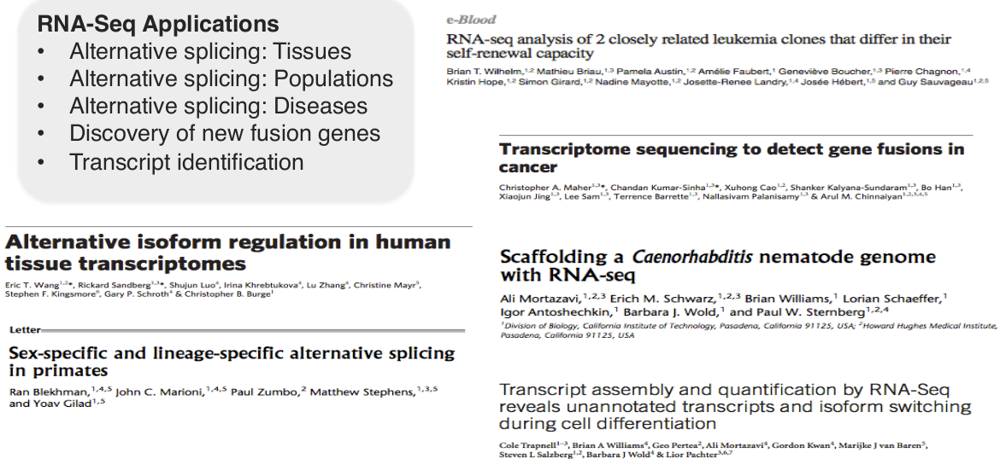

*Artículos en los que el RNA-seq ha sido importante a la hora de entender mecanismos biológicos tales como los de la lista.*
*Finalidad del RNA-seq -> descubrir eventos que involucren a genes y que provoquen la aparición de enfermedades como el cáncer. Consecuentemente, lo que vamos a hacer es alinear estos tránscritos al transcriptoma, con el fin de estudiar las diferencias.*

---

## RNA-seq Workflow

**Experimental Design -> RNA Preparation ->  Library Preparation -> Sequencing -> Data Analysis**

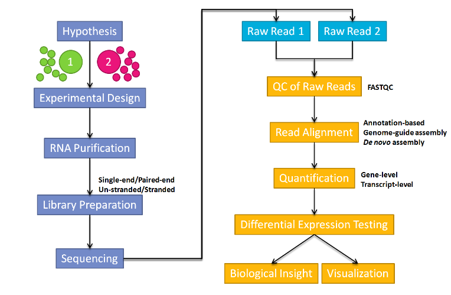

*[Figure reference](https://databeauty.com/blog/tutorial/2016/09/13/RNA-seq-analysis.html)*

---

## Brief Introduction to Microarrays

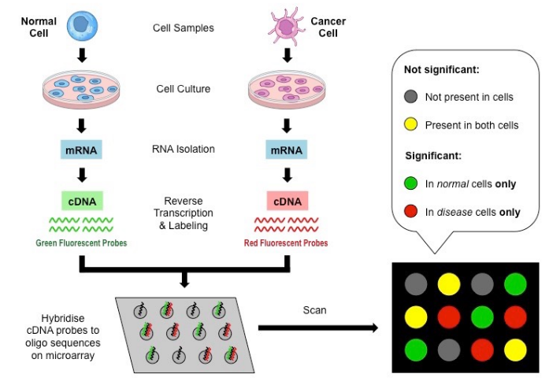

[video: DNA Microarray Methodology](https://www.youtube.com/watch?v=0ATUjAxNf6U&feature=youtu.be&ab_channel=BioNetwork )

*Un microarray de DNA es una colección de secuencias microscópicas de DNA (oligos) enganchados en una superficie sólida. Estas secuencias representan una librería de fracciones de genes presentes en la célula. Si el gen está activo en la célula que estamos analizando, el cDNA (producido a partir de un tránscrito de mRNA) se unirá a los oligos complementarios. Si el cDNA se etiqueta con fluorescencia, lo podremos identificar. Cada uno de los oligos representan una secuencia conocida, de forma que enfermedades genéticas se pueden identificar a través de qué oligos han sido “hibridados” Cuanta más expresión de un gen en particular, más fluorescencia. Además, estos arrays se pueden utilizar como forma para identificar nuevos genes involucrados en una enfermedad. Si el cDNA de una célula sana y una enferma son etiquetadas con distintos fluoróforos  (distinto color), podremos hacer comparativas para ver qué genes sólo están activos en la muestra enferma o normal.*

### Microarrays vs. RNA-seq

*RNA-seq*

- Base-pair level resolution.
- Absolute abundance of transcripts.
- All transcripts are present and can be analyzed: mRNA / ncRNA (snoRNA, lncRNA, eRNA, miRNA...)
- Analysis of allele-specific gene expression.
- Detection of fusions and other structural variations.
- De novo annotation.

*Microarrays*

- Indirect record of expression level (complementary probe)
- Relative abundance. Quantification by fluorescence.
- Cross-hybridization.
- Content limited (can only show you what you're already looking for).

---

*RNA-seq current disadvantages*

- More expensive than standard expression arrays.
- More time consuming than any microarray technology.
- Some (lots of) data analysis issues (not standard pipeline).
- Computing accurate transcript model.
- Mapping reads to splice junctions.
- Contribution of high-abundance RNAs (i.e. ribosomal) could dilute the remaining transcript population; sequencing depth is important.

---

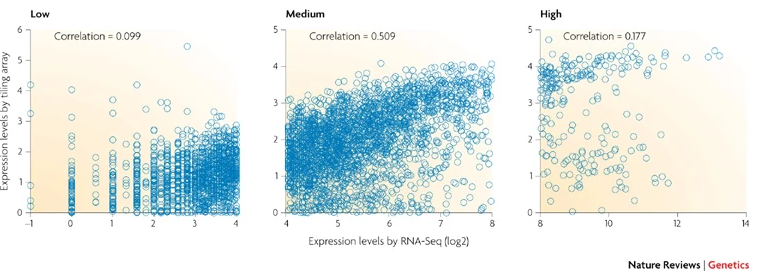

The two methods agree fairly well for genes with medium levels of expression (middle), but correlation is very low for genes with either low or high expression levels.

Wang, Z., Gerstein, M. & Snyder, M. RNA-Seq: a revolutionary tool for transcriptomics. Nat Rev Genet 10, 57–63 (2009). https://doi.org/10.1038/nrg2484

*Esta figura proviene de un paper en el cual se compararon los resultados de unas muestras analizadas mediante RNA-seq (Illumina Genome Analyzer II) y microarrays (Affymetrix Rat Genome 230 2.0 arrays) para detectar genes expresados diferencialmente en riñon (de ratas). Los resultados explican una correlación media en genes de expresión media. Correlación baja en genes de baja expresión y de alta expresión. Pero aunque los genes que coincidían como Dexpresados sólo suponían el 40-50% del total, la interpretación biológica fue consistente en ambos estudios. Esto quiere decir que aunque no vamos a poder utilizar el mismo tipo de análisis para ambos datos, ni se van a poder comparar a nivel de expresión, sí vamos a poder hacer meta-análisis comparativos (funcionales).*

---

## How to measure the expression?

**RPKMs, FPKMs, TPMs, counts**

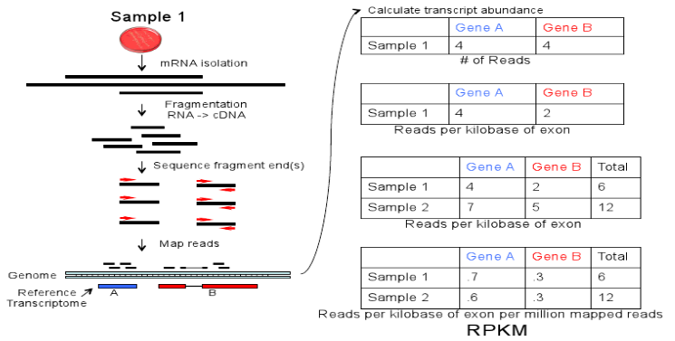

[RPKM, FPKM and TPM, Clearly Explained!!!](https://www.youtube.com/watch?v=TTUrtCY2k-w&feature=youtu.be&ab_channel=StatQuestwithJoshStarmer)

*Al final del proceso de secuenciación se obtendrá una matriz numérica. Esta matriz está representada por las muestras (en las columnas) y los genes (en las filas). Los números van a corresponder al número de lecturas. Las lecturas: (reads) son cada una de las secuencias que lee el secuenciador, cada una de las posiciones de la read se leyó en un ciclo de secuenciación. Para cada posición se reporta una base y un valor de calidad. A su vez, cada read tiene un identificador único.*
*La expresión de los genes se puede definir mediante distintas métricas. Estas medidas suelen tender a normalizar la matriz de cuentas por la profundidad de secuenciación y la longitud del gen.*

*RPKMS:*
*Se cuenta el número total de lecturas en una muestra y se divide por 1,000,000 (de ahí el “por millón”) Divide las cuentas por este factor de forma que estarás haciendo una normalización por profundidad de secuenciación (dándote reads por million, RPM). Divide estos RPMs por la longitud del gen (en kilobases). Esto te dará RPKMs.*

*FPKMS:*
*Muy parecido a RPKM. Las cuentas RPKM se crearon para los RNA-seq single end, donde cada uno de los reads corresponde a un fragmento único. FPKM sirve para pair-end rnaseq. En este tipo de secuenciaciones, dos lecturas pueden corresponder a un mismo fragmento (de forma que evitamos contar el mismo fragmento dos veces.*

*TPMs:*
*Para calcular los TPMs, lo que vamos a hacer es dividir las lecturas por la longitud de cada gen en kilobases. Esto da a lugar a lecturas por kilobase (RPK). Cuenta todos los RPKs que existen por una muestra y divide esto por 1,000,000. Es decir, la única diferencia es que primero normalizas por la longitud de cada gen y luego por la profundidad de secuencia. Pero aunque no lo parezca, la cosa cambia bastante. Cuando usas TPMs, la suma de todos los TPMs de cada muestra son los mismos. Esto hace que sea más sencillo comparar la proporción de lecturas que mapean a un gen en cada una de les muestras. En contraste, cuando utilizas RPKMs o FPKMs, la suma de las lecturas normalizas de cada muestra va a ser diferente.*
    
---

# Experimental Design

## Overview

- Biological comparison(s).
- Paired vs. single-end reads.
- Read length, [depth](https://emea.support.illumina.com/bulletins/2017/04/considerations-for-rna-seq-read-length-and-coverage-.html#:~:text=Read%20depth%20varies%20depending%20on,size%2C%20along%20with%20project%20aims.), [coverage](https://www.ecseq.com/support/ngs/how-to-calculate-the-coverage-for-a-sequencing-experiment).
- Replicates.
- Pooling.

*A la hora de diseñar un experimento de RNAseq es importante que nos preguntemos: con qué finalidad lo estamos haciendo y cuáles son las principales características de mi sistema biológico.*

---

## Experimental Objectives

**What are my goals?**

- Transcriptome assembly?
- Differential expression (DE) analysis?
- Identify new/rare transcripts?

**What are the features of my biological system?**

- Large, complex genome?
- Introns and high degree of alternative splicing?
- No reference genome or transcriptome?

---

## Experimental Complexity

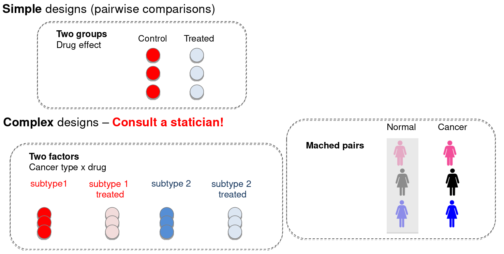

*Mientras que los diseños más simples conforman comparativas directas, la cosa se puede complicar. En el caso po ejemplo de tener varios subtipos y factores o muestras pareadas.*

*Matched pairs: the participants share every characteristic except for the one under investigation. A “participant” is a member of the sample, and can be a person, object or thing. A common use for matched pairs is to assign one individual to a treatment group and another to a control group. This process, called “matching” is used in matched pairs design. The “pairs” don’t have to be different people — they could be the same individuals at different time. The paired sample t test (also called a “related measures” t-test or dependent samples t-test) compares the means for the two groups to see if there is a statistical difference between the two.*

---

**Technical replicates**

- Not needed if low technical variation.
- Minimize batch effects.

**Biological replicates**

- Not needed for transcriptome assembly
- Essential for differential expression analysis
- Difficult to estimate

**Pooling samples**

- Limited RNA obtainable.
- Transcriptome assembly.

---

**Other important stuff you should take into account**

- The existence or completeness of a reference genome.
- Sequencing depth.
- Replicates! 
- Sequencing resources (longer reads better results)
- Computing resources.
- Type of data set generated.
- Most importantly: the overarching goal of the sequencing project.

---

## RNA-seq best practices

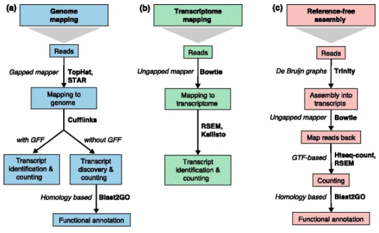

Conesa, A., Madrigal, P., Tarazona, S. et al. A survey of best practices for RNA-seq data analysis. Genome Biol 17, 13 (2016). https://doi.org/10.1186/s13059-016-0881-8

*Read mapping and transcript identification strategies.*

---

# Library Preparation

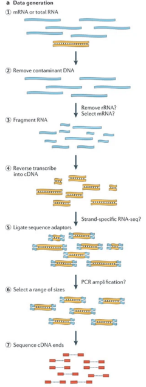

1) RNA (light blue) is first extracted.
2) DNA contamination is removed using DNAse.
3) and the remaining RNA is broken up into short fragments.
4) The RNA fragments are then reverse transcribed into cDNA (orange).
5) sequencing adaptors (blue) are ligated.
6) and fragment size selection is undertaken sequencing.
7) Finally the ends of the cDNAs are sequenced using NGS technologies to produce many short reads (red). If both ends of the cDNAs are sequenced, then paired-end reads are generated, as shown here by dashed lines between the pairs.

Martin, J., Wang, Z. Next-generation transcriptome assembly. Nat Rev Genet 12, 671–682 (2011). https://doi.org/10.1038/nrg3068

--- 

# Sequencing

Link to sqeuencing platforms: [NGS file formats](https://gitlab.com/fpozoc/advanced_bioinformatics/-/tree/master/ADB-02-ngs-linux/theory#ngs-platforms)

---

# Data Analysis

## RNA-seq: workflow

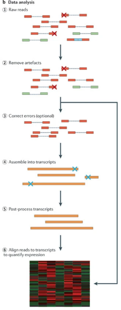

Martin, J., Wang, Z. Next-generation transcriptome assembly. Nat Rev Genet 12, 671–682 (2011). https://doi.org/10.1038/nrg3068

---

**Quality control (FastQ) -> Read mapping (SAM) -> Quantification (tsv) -> Differential expression analysis (tsv)**

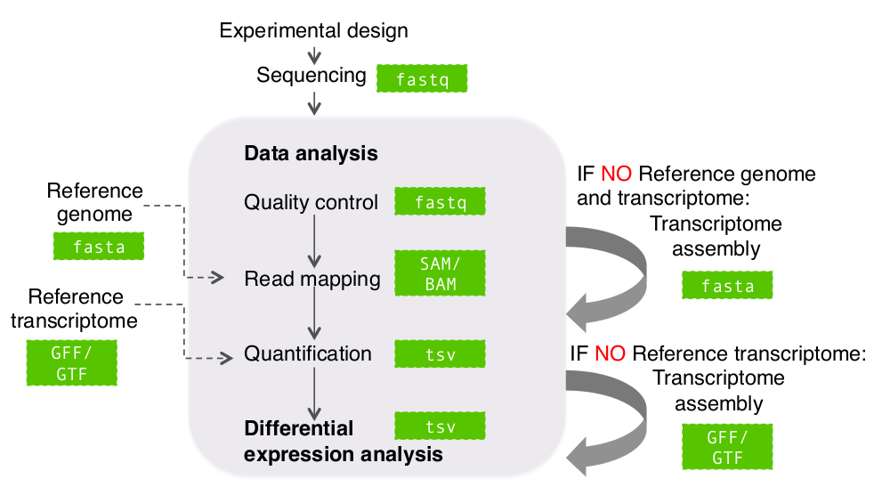

---

## RNA-seq file formats

Link to class 2: [NGS file formats](https://gitlab.com/fpozoc/advanced_bioinformatics/-/tree/master/ADB-02-ngs-linux/theory#ngs-file-formats)

--- 

## RNA-seq: alignment

**What is a spliced aligner?**

Alignment algorithm must be:

- Fast
- Able to handle SNPs, indels, sequencing errors...
- Allow for introns for reference genome alignment (spliced alignment)

**Examples: TopHat, HISAT, STAR**

*Las lecturas derivan directamente de mRNA maduro, de manera que ¿qué les falta? Los intrones. Pero los alineadores generalmente trabajan con el genoma de referencia, de manera que una lectura puede corresponder a varios exones con intrones de por medio. De esta manera, la lectura correspondería a uno de los exones exclusivamente si esto no fuese tenido en cuenta, mientras que el resto de la lectura no encajaría porque lo que sigue es el intron. Un alineador “splice-aware” o  que tiene en cuenta el splicing, será aquel que pueda tener encuenta estos eventos, de manera que la lectura se pueda alinear a su referencia sin que la presencia de intrones suponga una desventaja.*

*Estos alineadores generalmente dividen sus tareras en dos: un paso inicial en el cual las lecturas son analizadas para identificar las uniones entre exones. Y un segundo paso donde estas uniones que se han identificado se van a utilizar para que el alineador las tenga en cuenta.*

---

## RNA-seq: assembly

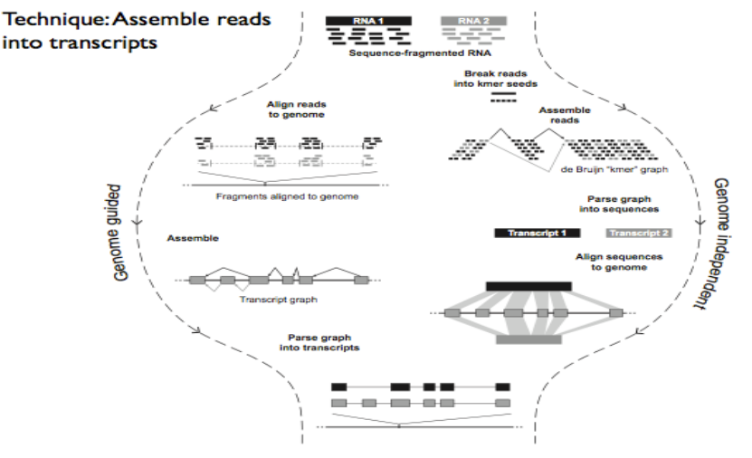

---

- **Goal**: Find out where a read originated from.
- **Challenge**: variants, sequencing errors, repetitive sequences...
- **Mapping to**: transcriptome allows you to count hits to known transcripts. Genome allows you to find new genes and transcripts.
- **Many organisms have introns, so RNA-seq reads map to genome non-contiguosly -> spliced alignments needed**: difficult because sequence signals at splice sites are limited and introns can be thousands of bases long.
- **ab initio** reference-based Software: TopHat, Blat, Scripture, Cufflinks. de novo Software: Rnnotator, Oases, Trinityz.

*Una vez hemos examinado la calidad de las lecturas y cortado aquellas partes que parecen estar en mal estado, vamos a “emparejarlo” con el genoma de referencia con el fin de descubrir de qué genes vienen cada una de las lecturas. No es tan facil hacer este alineamiento debido a la existencia de variantes en el genoma. Además de errores de secuenciación y la repetición de partes de secuencias, de forma que cuando quieres colocor una read en alguna parte, es difícil descubrir de dónde viene.Cuando secuenciamos RNA, lo que estamos secuenciando son los exones necesitamos splice aware aligners. Por otro lado, generalmente alineamos al genoma, de forma que podemos encontrar nuevos genes y tránscritos. Cuando mapeamos directamente al transcriptoma, no vamos a detectar las distintas isoformas.*
*En la práctica usaremos TopHat, que es el alineador más utilizado a nivel de experimentos de RNAseq y que tiene por dentro otro alineador que se llama bowtie.*

---

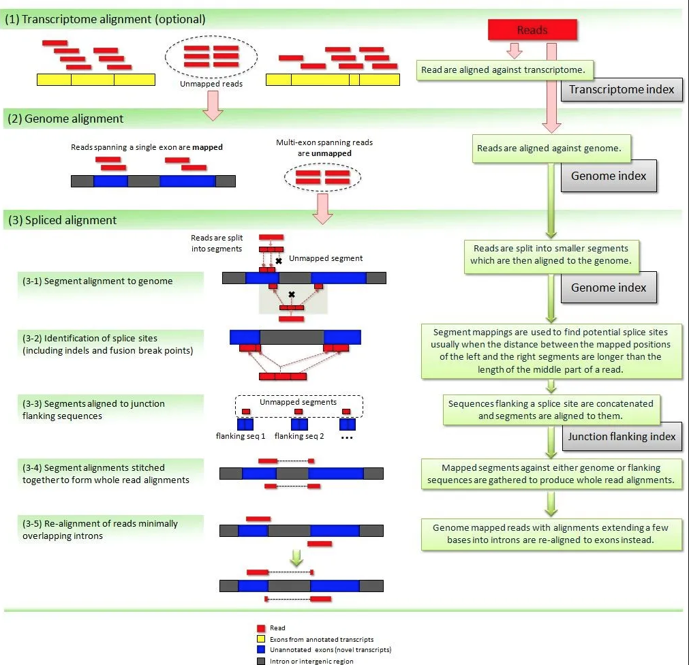

*1.Alineamiento al transcriptoma (opcional). Si se le da el transcriptoma al alineador: localización de los exones e intrones de genes conocidos, tophat creará una referencia transcriptómica. Una vez obtenida, utilizará las lecturas para “matchearlas” al transcriptoma.*
*2.Alineamiento al genoma. Los reads que no han mapeado, se comparan con el genoma completo.*
*3.Alineamiento con splicing.Los reads que no mapean: al splice alignemnt. Se cortan en piezas de 25bases y buscamos situaciones en las cuales el primer segmento y el segundo se ecuentran separados por un intrón. Básicamente, se busca aquellas situaciones en las cuales el mapeo de los segmentos izquierdo y derecho de una lectura, se encuentran a una distancia más larga que la longitud de la zona central. Además, a la máquina le constará menos tiempo encontrar dónde mapea el tercer segmento una vez se ha acotado la zona de posibilidades. Una vez hecho esto, tophat selecciona un trocito de secuencia de cada uno de los extremos del exón que rodea al intron central y las junta, generando una colección de “flanking sequences” o secuencias flanqueantes (unón flank1+flank2). Se crea una “flanking database o splice site database”. Una vez obtenida, se utilizará para realinear aquellas lecturas que podían haberse visto afectadas. (3-5) Tienen que haber situaciones en las cuales un par de bases no matcheaban bien, ahora vuelve y las coloca en el siguiente exón, donde correspondía.*
*4.Tophat es: Relativamente rápido y eficiente a nivel de memoria.*

---

## RNA-seq: transcriptome assembly with Cufflinks

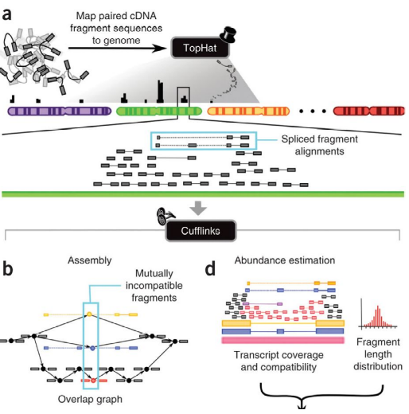

*a.El algoritmo utiliza como input la secuencia de los fragmentos de cDNA que han sido alineados previamente al genoma. Este alineamiento debería hacerse mediante secuencias alineadas usando un alineador splice-aware (tophat).*
*b.Primero se identificarán pares de fragmentos “incompatibles”, tienen que haber sido originados por distintas isoformas ya que no encajan. Estos fragmentos son conectados en lo que se llama un “grafo de solape” (overlap graph) cuando son compatibles. En ese ejemplo, los fragmentos amarillo, azul y rojo son incompatibles y se han originado a partir de isoformas distintas. Todos los demás pueden venir de uno de estos.*
*b-e. En el caso de las lecturas paired-end, Cufflinks utiliza cada par de lecturas como una lectura única.*

---

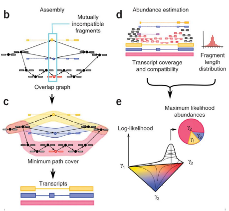
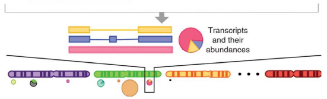

*c. Las isoformas son ensambladas a partir de este grafo. Todas las rutas que se establecen a partir de este grafo corresponden a fragmentos compatibles que pueden ser combinados en una isoforma completa. En este caso, hay tres rutas: la azul, roja y amarilla. Este proceso se minimiza con el fin de obtener el mínimo número posible de rutas que expliquen las diferencias entre isoformas.*
*d. El siguiente paso consiste en estimar la abundancia de estas isoformas. Cada uno de los fragmentos de lectura se matchean con aquellos tránscritos de los que provienen. Los tránscritos grises indican que podrían haber venido de cualquiera de las isoformas existentes. Cufflinks utiliza un modelo estadístico para estimar la abundancia de estos fragmentos en el cual la probabilidad de observar cada fragmento corresponde a una función lineal de las abundancias de los tránscritos de los que se podrían haberse originado. Por ejemplo, el fragmento violeta podría venir de la isoforma roja o de la azul. Los fragmentos grises de todas las isoformas que hemos detectado. 
d.1 Fragment length distribution. La longitud de los fragmentos se tiene en cuenta a la hora de asignar pertenencia a una isoforma concreta. Por ejemplo, el fragmento violeta es muy largo y por tanto, sería improbable que hubiera sido originado de la isoforma roja, lo lógico es que viniera de la azul. Esta operación se maximiza mediante un ajuste de máxima verosimilitud. Como resultado, determina qué abundancias se ajustan mejor a nuestro modelo de fragmentos.*

---

## RNA-seq: Differential gene/isoform expression

The ultimate objective of many RNA-seq studies is to identify **features of the transcriptome** that are **differentially expressed** between or among groups of individuals or tissues that are different with respect to some **condition**.

Some general statistical approaches used to test hypotheses of differential expression: 

- Normalization of read counts.
- Discrete distribution models.
- Continuous distribution models.
- Nonparametric models.
- Different software.

Reference: [RNA-seqlopedia](https://rnaseq.uoregon.edu/#analysis-diff-exp)

---

## RNA-seq: Methods summary

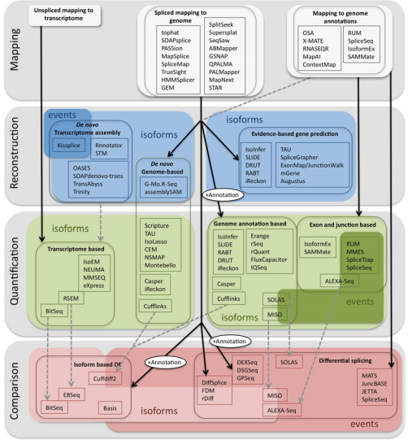

Graphical representation of methods to study splicing from RNA-Seq

Alamancos GP, Agirre E, Eyras E. Methods to study splicing from high-throughput RNA sequencing data. Methods Mol Biol. 2014;1126:357-397. doi:10.1007/978-1-62703-980-2_26

*Es importante saber que durante los últimos años ha existido una explosión de diferentes métodos para todas las alternativas que produce el RNA-seq.*

---

# Conclusions

- **RNA-Seq** is a complete and versatile method for transcriptome analysis which enables transcript quantification and novel transcript discovery.
- **Expression quantification** is based on sampling and counting reads derived from transcripts.
- **Fold changes** based on few read counts lack statistical significance.
- **Multiple analysis frameworks** are available and often complementary approaches to support biological investigations.